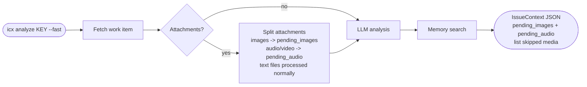
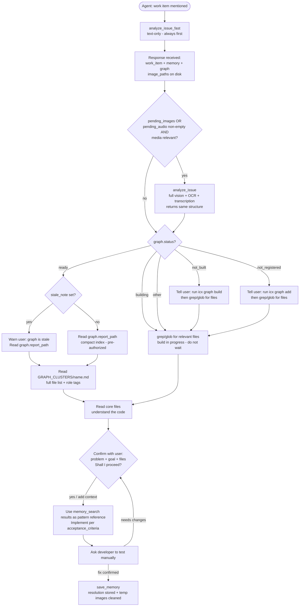
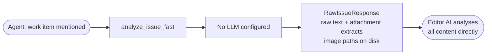

# ICX - Integrated Contextual X-ecution Engine

**AI-native intelligence layer for development teams.** Deep context extraction, multi-modal analysis, local-first RAG memory, a multi-language codebase knowledge graph, SonarQube code-quality insights, and AI-assisted testing. Securely bridge your work tracker to your AI agents via MCP.

[](https://pypi.org/project/icx-engine/)
[](https://pypi.org/project/icx-engine/)
[](./license)
[](https://github.com/althaf-space/icx-engine/releases)

> **ICX is under active development.** Features ship frequently. The API surface is stabilising. See the [changelog](#changelog--releases) for what changed in each release, and watch the repo to get notified of new versions.

---

ICX reaches into your work tracker, reads every item at full depth - title, description, comments, attachments, screenshots, spreadsheets, audio recordings, screen-capture videos - and delivers structured, high-fidelity context your AI can act on immediately.

Run `icx analyze` from your terminal for instant structured output. Register ICX as an MCP tool in your AI editor and let your agent call it automatically. Local memory captures every resolution so past fixes surface the next time a similar problem appears.

**Currently supports:** Jira Cloud

---

## What's being built

ICX is an early-stage product. The core pipeline (fetch -> process -> analyse -> memory) is stable and used in production. The areas below are actively worked on:

| Area | Current state | Coming next |
|------|--------------|-------------|
| Connectors | Jira Cloud (stable) | GitHub Issues, Linear |
| LLM providers | Anthropic, OpenAI, Google, Ollama, NIM, xAI | Provider-level prompt caching |
| Attachments | PDF (incl. scanned/OCR), DOCX, XLSX, XLS, PPTX, CSV, ZIP, code/text/config files, images via OCR + vision, audio (MP3/WAV/M4A/OGG/FLAC/AAC/Opus) + video (MP4/MOV/AVI/MKV/WebM, full-duration frame sampling) via local Whisper or LLM-native transcription | Speaker diarisation, language hints |
| Memory | Local LanceDB + ONNX embeddings (BAAI/bge-base-en-v1.5, 768-dim, no PyTorch) | Team-shared memory, conflict resolution |
| MCP tools | `icx_boost`, `icx_boost_refine`, `icx_skill_get`, `icx_skills_index`, `draft_skill`, `analyze_issue_fast`, `analyze_issue`, `memory_search`, 10 graph tools, 4 historical memory tools, `save_memory`, `record_verification`, `reinforce_memory_usage`, `get_memory_audit`, 3 testing tools (`start_testing_session`, `resume_testing_session`, `get_testing_session_status`), 1 methodology tool (`get_methodology`), 1 spec-lock tool (`lock_plan`), 2 UI-auth tools (`ui_auth_capture`, `ui_auth_inline`), 7 Sonar tools (`sonar_status`, `sonar_projects`, `sonar_branches`, `sonar_measures`, `sonar_quality_gate`, `sonar_findings`, `sonar_report`) (40 total) | Batch analysis, project-level summary |
| Codebase graph | Project registration, AST + semantic build, LSP-powered edge resolution (Pyright, TypeScript, Jedi, Java symbols), JSP/Servlet, Go, C#, PHP, Rust, C++, Swift, Elixir, Scala, Rails, Angular, gRPC/Protobuf, Terraform/HCL, event broker detection (Kafka, RabbitMQ, Redis, SQS, SNS, NATS), co-change history, gopls/kotlin-language-server/rust-analyzer/OmniSharp/intelephense/clangd compiler-grade edges, incremental rebuild (SHA-256 hashing), multi-source edge fusion, PageRank + betweenness centrality, blast radius, cycle detection, dead code, CODEOWNERS integration, staleness detection, .icxignore exclusions, compact index + per-cluster files + role tags + LLM descriptions, GraphQuerier API | Multi-project graph, team-shared graph cache |

If something does not work as expected, [open an issue](https://github.com/althaf-space/icx-engine/issues). Fixes ship fast.

---

## How ICX works

ICX operates in three modes depending on how you call it and what you have configured.

**CLI mode** - run `icx analyze KEY` from your terminal. ICX fetches the work item, processes every attachment, runs your configured AI model, queries local memory for similar past resolutions, and prints a structured JSON summary to stdout.

**MCP mode** - your AI editor calls ICX directly during a conversation. ICX exposes a set of MCP tools; the agent calls `analyze_issue_fast` first - it returns structured analysis, memory results, and the codebase graph navigation map in a single response. The agent reads the compact graph index, opens the relevant cluster file, reads core files, then presents a confirmation summary before writing any code. You confirm (or add context), the agent implements, and saves the resolution when you confirm it works.

**MCP headless mode** - same as MCP mode but with no AI provider configured. ICX returns all raw content - text, attachment extracts, and image file paths - directly to your editor's AI for analysis. No separate API key required.

---

## Flows

### CLI - full analysis


### CLI - fast mode

Skip all attachment processing and get text-only output immediately. Skipped filenames are preserved in `pending_images` (images), `pending_audio` (audio + video), `pending_documents` (PDF/DOCX/XLSX/XLS/PPTX/CSV/ZIP/code+text files), and `pending_unsupported` (other types) so nothing is lost.



### MCP - agent flow with AI provider



### MCP headless - no AI provider



---

## Install

**Version:** 0.3.9 &nbsp;|&nbsp; **Requires Python 3.11, 3.12, 3.13, or 3.14**

```
pipx install icx-engine
```

The first time you run `icx setup`, ICX downloads a local embedding model (~110 MB) for memory search. This happens once with a live progress bar. Every subsequent start is instant.

After upgrading ICX, run `icx update` to apply any new config defaults and initialise new storage components.

**Optional - OCR for image attachments:**

| Platform | Command |
|----------|---------|
| Windows | `winget install UB-Mannheim.TesseractOCR` |
| macOS | `brew install tesseract` |
| Linux | `apt install tesseract-ocr` |

Without Tesseract, images are still processed via your AI provider's vision model if configured. ICX shows a one-time warning and continues normally.

**Audio and video transcription** ships bundled - `faster-whisper` (~145 MB base model, downloaded once on first audio attachment to `~/.icx/audio/model/`) and the static `imageio-ffmpeg` binary for video -> audio extraction. No system packages required. With OpenAI configured, ICX uses the Whisper API (large-v2 accuracy); with Google, it uses Gemini native audio; otherwise it transcribes locally and routes the result through your text LLM for cleanup.

**Uninstalling:** Use `icx uninstall` instead of bare `pip uninstall` - it removes all data, credentials, editor configs, and the package in one step.

---

## Quick start

```sh
# 1. Connect your work tracker
icx connection --add

# 2. Add an AI provider (for full analysis)
icx model --add

# 3. Analyse a work item
icx analyze PROJ-456
```

ICX works without an AI provider in MCP mode - your editor's AI handles the analysis directly.

---

## All commands

### Analysis

```sh
icx analyze <KEY>
icx analyze <KEY> --fast                       # skip image processing
icx analyze <KEY> --profile NAME               # use a specific LLM profile for this run
icx analyze <KEY> --profile NAME --fast        # profile + skip image processing
icx analyze <KEY> --path PATH                  # show graph status for a codebase path
icx analyze <KEY> --path P1 --path P2          # show graph status for multiple paths
icx analyze <KEY> --debug                      # show step-by-step pipeline output
icx analyze <KEY> --traceback                  # show full Python traceback on error
```

`KEY` can be a bare issue key (`PROJ-456`) or a full URL (`https://company.atlassian.net/browse/PROJ-456`).

Image attachments are written to `~/.icx/temp/<key>/` and returned as `image_paths` in the JSON output. No base64 in the output. Audio and video transcripts are inlined into `attachment_texts` under the original filename.

| Flag | What it does |
|------|-------------|
| `--fast` | Skip all attachment processing (images, audio/video, documents). AI still analyzes issue text and comments. Skipped files listed in `pending_images`, `pending_audio`, `pending_documents`, or `pending_unsupported` depending on type. |
| `--profile NAME` | Use a specific AI profile without changing your default. Combinable with `--fast`. |
| `--path PATH` | Show graph status for a codebase path after the analysis. Repeatable - pass multiple `--path` flags for multi-repo issues. Shows READY/BUILDING/NOT BUILT/NOT REGISTERED for each path. |
| `--debug` | Print each pipeline step to stderr as it runs. |
| `--traceback` | Show full Python traceback on error. |

### Connections

```sh
icx connection --add                       # connect a new account
icx connection --remove DOMAIN             # remove by domain
icx connection --remove INDEX              # remove by index from icx status
icx connection --active DOMAIN             # set default connection
icx connection --active INDEX              # set default by index
```

### LLM profiles

```sh
icx model --add                            # add a new AI profile
icx model --remove PROFILE                 # remove entire profile by name
icx model --remove INDEX                   # remove profile by index from icx status
icx model --remove PROFILE --channel <CHANNEL> # remove only the image/vision channel (text or image)
icx model --active PROFILE                 # set active profile
```

Supported providers: OpenAI, Anthropic (Claude), Google (Gemini), xAI (Grok), Ollama / LM Studio, Nvidia NIM.

### Memory

```sh
icx memory save <KEY>
icx memory save <KEY> --note "Fixed by updating TTL" --files "auth/token.py" --confirmed
icx memory search "OAuth token expires"
icx memory list
icx memory list --project PROJ
icx memory list --source jira
icx memory show <KEY>
icx memory delete <KEY>
icx memory export
icx memory export --output backup.json
icx memory import backup.json
icx memory clear --confirm
icx memory status
icx memory migrate
icx memory by-file <PATH>
icx memory by-file <PATH> --project PROJ
icx memory hotspots
icx memory hotspots --project PROJ --top 10
icx memory related <KEY>
icx memory related <KEY> --project PROJ
icx memory patterns
icx memory patterns --project PROJ
```

### Skills

```sh
icx skills list                       # list every skill ICX has learned from verified fixes
icx skills create                     # create a skill by hand - no ticket required
icx skills delete <NAME>              # delete one skill
```

### Codebase graph

```sh
icx graph add --name NAME --path PATH --project KEY   # register a project directory (--project required, e.g. a Jira project key like PROJ)
icx graph build NAME               # build (or rebuild) the knowledge graph for a project
icx graph build --project KEY      # build all graphs tagged with this tracker project key (case-insensitive)
icx graph build NAME --force       # rebuild even if graph is current
icx graph list                     # list all registered projects with status and file counts
icx graph status NAME              # detailed status: build state, last commit, staleness info
icx graph remove NAME              # remove a project and its graph data
icx graph remove NAME --keep-cache # remove project but keep cached graph files
```

Graph data (including build cache) is stored in `~/.icx/graphs/` - nothing is written inside your project directories.

### Testing

```sh
icx test configure                            # set testing defaults (max fix-iteration limit)
icx test rules                                # show the per-gate rulebook (~/.icx/testing_rules); --reset re-seeds
icx test sessions                             # list all active testing sessions
icx test cancel <SESSION_ID>                  # cancel an active testing session
icx test analytics                            # render the run-history analytics dashboard (flakiness, pass-trend, slowest tests, heals); opt-in when ICX_TEST_ANALYTICS=1
```

**Local engine.** Verification runs fully in-process and async - there is no external tester to install or keep running. For `unit`/`api`, ICX detects the right runners for the layer and runs them on the repo-correct runtime; for `agent`, the connected editor agent runs its own Playwright test and ICX reads the result. Either way ICX reports one normalized result plus a Definition-of-Done confidence score. Agent tests run headless by default; at the URL gate you can choose a visible browser and a slowmo delay (default 1s when visible, 0 when headless) so the agent's own browser is watchable.

**Human-readable reports.** After each test run, ICX also writes a browser-viewable HTML report to `~/.icx/testing/reports/` (open `index.html` for a newest-first list of all runs) - the human view alongside the structured result your MCP agent gets. Every test expands to what it checked, how it ran, the pass criteria, and the result; a "Security scan" section lists all security findings by severity.

**Agent-authored, self-healing Playwright tests.** For `agent` runs, ICX first drives a per-framework Element Census (React/Angular/Vue/Svelte) that enumerates and reconciles every interactive element, field, validation, and message on the screen, then fuses it with a live crawl of the real page so every selector in it already resolves - so authoring misses nothing (the count reconciliation makes "nothing missed" verifiable). ICX hands that model, the target URL, the restored auth session, and its own pinned Playwright install to your connected editor agent, which writes a real Playwright test, runs it itself, reads Playwright's own failures, and fixes and re-runs its own script until a durable, user-editable checklist (`icx test rules`) is covered - no custom interpreter in between to misreport a real failure as "0 tests ran".

**NL/ticket-driven scenarios.** In agent mode, ICX can pass extra scenario guidance into the authoring gate from a plain-English intent (`nl_intent`) or a ticket's acceptance criteria (`acceptance_criteria`), both optional on `start_testing_session` - the connected editor agent authors and asserts a scenario for each as part of its own test.

**Fast path for re-testing a known screen.** Testing the same screen again normally redoes file discovery, the element census, and the compatibility scan - by default, every time. If ICX finds a prior cleared run of that exact screen where every cached file is still byte-identical AND a quick re-check finds no new related file, it offers a `known_screen` gate: reuse the cached scope/census and jump straight to URL/layer confirmation, or redo everything from scratch anyway. Any change at all to a cached file - or a genuinely new related file appearing - skips this gate entirely and just re-runs the full pipeline; there is no way to force the fast path when it isn't provably safe.

**ICX brings its own runners.** The test tooling ICX needs (Playwright for the agent layer, Schemathesis/Hurl for API, mutmut/Stryker for mutation, gotestsum/nextest bridges) is installed by ICX under `~/.icx/testing/<runner>/<version>/`, version-pinned - but only after you approve it. Run `icx test setup` to install it. Nothing installs silently (set `ICX_AUTO_INSTALL_RUNNERS=1` to opt in); if a runner is missing and not approved, that layer is reported unavailable rather than crashing. This is separate from your language SDKs, which ICX discovers and reuses (never installs). Only the agent layer needs Node (Playwright is Node-only) - and the harness Node is separate from your app's Node, so a Node-14/16 project still gets agent testing on a discovered Node 18+ (or set `ICX_HARNESS_NODE`); this is the same pinned install your connected agent is handed for its own test run, never a bare `npx`/global one. Full provisioning + air-gapped/offline guide: [docs/testing-setup.md](docs/testing-setup.md).

**Rulebook.** The mandatory rules the AI agent must follow at each testing gate live as editable Markdown in `~/.icx/testing_rules/` (one file per gate, seeded from bundled defaults on first use). ICX loads the relevant file and injects it into every gate, so the rules apply in every session and can't drift out of the agent's context - edit a file to change agent behavior on the next gate, no code change. For gate 2b (spec generation), ICX also enforces that every section listed in `2b.md` is present and re-asks the agent until the spec is complete, so an incomplete spec can never be silently submitted. Run `icx test rules` to see the files and the sections enforced.

**Security testing (DAST + SAST + secrets + SCA, native, no installer).** Security is not a separate tool you install - the checks run inside every test run, self-hosted and deterministic. Runtime (DAST): for `agent` runs, a durable checklist (`icx test rules`) mandates XSS/SQLi-shaped probes across every free-text input, including search/filter boxes, in the agent's own test; each API endpoint gets 8 injection classes (SQLi/NoSQL/command/template/path/LDAP/XPath/CRLF), mass-assignment, broken-auth, object-level (IDOR-adjacent) and response-security-header checks. Static (over your own source): a secrets scan (cloud keys, private keys, tokens, hardcoded credentials - masked in the report), SAST-lite (real Python AST + cross-language rules for `eval`/`exec`, `shell=True`, disabled TLS, SQL string-concat, `innerHTML`/`dangerouslySetInnerHTML`, wildcard CORS, weak hashes and more), and SCA (dependency manifests flagged for unpinned versions and matched against an optional offline advisory file - `ICX_SCA_ADVISORY` or `.icx-advisories.json`). Findings are severity-graded and shown in a dedicated "Security scan" section of the HTML report. Honest by design: rule/AST matching (not full taint-flow) and offline/manifest dependency checks (not a live CVE feed).

**Test-quality insight.** Every run also reports a "Test quality" section: which existing tests are relevant to your changed files (regression selection, from a read-only `git diff`), a before/after performance-regression comparison when you provide metrics (`ICX_PERF_BEFORE`/`ICX_PERF_AFTER`), and a mutation-testing score when you supply a mutation report (`ICX_MUTATION_REPORT`) - proving the unit tests actually catch bugs, not just run the code. Each shows real numbers when its inputs exist, or an honest "not run" with the reason - never a faked figure.

### Sonar (code quality)

ICX reads a SonarQube server directly over its Web API (read-only, no proxy) and hands structured, typed results to your AI agent. You can register multiple servers with one active, exactly like AI profiles - run `icx sonar add` to add one. The CLI is intentionally minimal; the rich surface is the MCP tools (see below), where the agent lists projects and branches, then scopes findings to the exact files a developer is working on.

```sh
icx sonar --add               # add a server connection (name, URL, token, TLS verify); first becomes active; validates live
icx sonar --list              # list connections and which is active (bare `icx sonar` also lists)
icx sonar --active <name>     # set the active connection
icx sonar --remove <name>     # remove a connection (clears its keyring token)
icx sonar status              # active connection + live connection health
icx sonar projects            # list projects the active token can access
icx sonar report --project <key> [--branch <b>] [--file <path>]...   # compact summary: gate + counts
```

Connections also show up in `icx status`.

### MCP server

```sh
icx mcp setup                    # register ICX with detected AI editors
icx mcp setup --host claude      # register with a specific editor
icx mcp remove                   # remove ICX from all detected editors
icx mcp remove --host claude     # remove from a specific editor only
icx mcp config                   # print copy-paste config snippets
icx mcp list                     # list all supported editors and detection status
icx mcp run                      # start the MCP server (editors call this automatically)
```

### General

```sh
icx setup        # download AI model files (run once after install)
icx update       # apply config migrations and verify storage after a package upgrade
icx status       # show all connections and AI profiles
icx logout       # remove all credentials from this machine
icx uninstall    # fully remove ICX - data, credentials, editor configs, package
icx --version
icx --help
```

Every command accepts `--debug` (step-by-step progress to stderr) and `--traceback` (full Python traceback on error) for troubleshooting.

---

## Memory - your personal knowledge base

Every team solves the same problems more than once. ICX memory captures what you learned and surfaces it automatically the next time a similar item appears.

### How it works

1. You fix and test a work item.
2. You run `icx memory save PROJ-456`.
3. ICX asks: what was the fix? which files changed? any tags?
4. ICX stores your answer locally.
5. The next time you run `icx analyze` on a similar item, ICX runs a hybrid semantic + keyword search and adds a "Past Insights" panel to the output with similarity scores.

Memory queries use the LLM-analysed fields from the output (`problem_summary`, `detailed_description`) rather than raw tracker text - this gives much higher quality matches even when the wording of the new item differs from how you described the old one.

### Saving a resolution

```sh
icx memory save PROJ-456

# Or non-interactively:
icx memory save PROJ-456 \
  --note "Increased JWT TTL from 1h to 24h" \
  --files "src/auth/token.py" \
  --tags "jwt,auth" \
  --confirmed
```

### Privacy

Memory data lives in `~/.icx/memory/` on your machine only. The directory is locked to your user account (mode `0700`). ICX never sends memory data to any server. The `icx memory export` command writes a JSON file you can review before sharing.

---

## Using ICX with AI editors (MCP)

`icx mcp setup` registers ICX in your AI editor. ICX detects which editors are installed (Claude Code, Cursor, Windsurf, Codex, Antigravity, VS Code) and adds itself to each one automatically - it also installs each editor's native `/icx-boost` command and its ticket/testing/sonar routing.

```sh
icx mcp setup                       # all detected editors
icx mcp setup --host claude         # Claude Code only
icx mcp setup --host vscode         # VS Code only
```

After setup, restart your editor. ICX will appear in its list of available tools, and `/icx-boost` in its command list.

For every editor, `icx mcp setup` also installs ICX-first routing for the narrow, high-precision cases: a work-tracker ticket reference (a key like `ABC-123`, or a Jira/GitHub/Linear/GitLab issue URL), a testing request, or a SonarQube/code-quality request. On Claude Code it's a `UserPromptSubmit` hook plus a `CLAUDE.md` rule; on the other editors, an instruction written into that editor's global-rules file. All of it is removed by `icx mcp remove`.

### The MCP tools

**`/icx-boost` - on demand, one call, two passes.** Boost is not something the agent calls on every message - it runs only when you (or your editor's MCP-prompt auto-surfacing) explicitly invoke `/icx-boost <your request>`. One call classifies the task, applies the mandatory ICX methodology, gathers only the codebase context the problem needs (graph/grep/memory - skipped for a plain question or when no repo is connected), and auto-refines the result into a CTO-grade prompt in the same call - no second tool call needed. For a work-tracker ticket, `analyze_issue_fast` remains the ticket entrypoint, and that routing stays always-on (see above), independent of whether boost was invoked.

| Editor | `/icx-boost` command |
|--------|----------------------|
| Claude Code | Skill at `~/.claude/skills/icx-boost/SKILL.md` |
| VS Code | Prompt file `.github/prompts/icx-boost.prompt.md` (an MCP prompt also auto-surfaces as `/icx.icx-boost`) |
| Cursor | Command at `~/.cursor/commands/icx-boost.md` |
| Windsurf | Workflow at `~/.codeium/windsurf/global_workflows/icx-boost.md` |
| Codex | Prompt at `~/.codex/prompts/icx-boost.md` |
| Antigravity | Workflow at `~/.gemini/antigravity/global_workflows/icx-boost.md` |

**Links are preserved and routed.** When a prompt (or a Jira ticket) contains a link - a Figma design, a SonarQube dashboard, another ticket - the boost keeps it and tags how to pull it: if ICX has a connector for it and it is connected, the agent is told to use ICX's own tool; if ICX has the connector but it is not connected, you are told to connect it; if ICX has none (e.g. Figma), the agent is told to fetch it with its own tool/MCP. ICX reuses existing connectors instead of building one for everything.

**Proving the boost.** Run `icx boost benchmark` to measure it: ICX runs a corpus of prompts through your configured ICX model - once raw, once with the ICX boost - and grades how many of each prompt's real requirements the answer covers, averaged over `--repeats` runs so the number is stable, not single-shot noise. The HTML scorecard (`~/.icx/boost/benchmark.html`) breaks the lift down by difficulty, archetype, and per-prompt. The boost's value shows on underspecified prompts (a real user's vague request), where a raw answer misses implicit requirements the boost forces out; on easy prompts a strong model already covers there is little headroom, and that is reported honestly. The figures are measured on your model - not a marketing claim.

| Tool | When the agent calls it |
|------|------------------------|
| `icx_boost` | Called via `/icx-boost`, not on every message - returns the auto-refined CTO-grade brief (intent, archetype, mandatory methodology, adaptive context, gates, boosted_prompt, and optionally skills.index with previously-learned matching expertise) in one call. Input: `prompt`, optional `repo_path`, `current_file`, `is_continuation`. When skills.index is populated, call `icx_skill_get` to retrieve full content. |
| `icx_boost_refine` | OPTIONAL further enrichment - `icx_boost` already auto-refines, so call this only for an even stronger result: the agent drafts a structured spec (objective/requirements/constraints/deliverable/acceptance/dims); ICX deterministically assembles a CTO-grade prompt with a per-problem expert persona (proven +18% coverage over the auto-refined default on vague requests). Input: `prompt` + any spec fields, optional `archetype`/`repo_path`/`current_file`. |
| `icx_skill_get` | Retrieve a learned skill by name. Called when `icx_boost`'s brief includes a `skills.index` entry, `save_memory`'s response includes `related_skills`, or `icx_skills_index` surfaced a name. Returns the full SKILL.md content (frontmatter + Markdown body: When to Use, Procedure, Pitfalls, Verification). Input: `name`. |
| `icx_skills_index` | Return every stored skill's name and description, unranked and uncapped - a safety net for when the scored rankers (`skills.index`, `related_skills`) miss something relevant. No input. |
| `analyze_issue_fast` | Always first - runs LLM analysis on text only, no attachment processing. Returns `work_item` (analysis + `image_paths` + `attachment_processing: "text_only"`), `memory`, and `graphs[]`. Timeout 45s. |
| `analyze_issue` | Only when any of `work_item.analysis.pending_images`, `pending_audio`, or `pending_documents` is non-empty AND that media is relevant to the problem. Pass the same `project_paths` as the fast call. |
| `memory_search` | Immediately after analysis - agent generates 3-6 tags from the analysis result and calls this for refined tag-filtered retrieval. Skip only when `memory.status != 'ready'`. |
| `graph_find_context` | Find the most relevant files and symbols for a task description. Input: `task`, optional `project_paths`. |
| `graph_subsystem` | List all files belonging to a subsystem cluster. Input: `file_path`, `project_path`. |
| `graph_call_chain` | Trace call chains forward or backward from a function. Input: `node_id`, `project_path`. |
| `graph_impact` | Find everything a file or function affects (callers, dependents). Input: `node_id`, `project_path`. |
| `graph_cross_links` | Find cross-service or cross-module dependencies. Input: `project_path`. |
| `graph_important_nodes` | Top files/functions by PageRank + betweenness centrality. Identifies architectural hotspots - useful before a refactor or when assessing blast radius. Input: `project_path`, optional `top_k`. |
| `graph_blast_radius` | Given a list of changed files, returns all direct and transitive dependents, a risk score (0.0-1.0), and co-change partners not yet in the changed set. Input: `changed_files`, `project_path`. |
| `graph_cycles` | Detect circular dependency chains using structural edges (imports, calls, implements). Returns chains up to `max_cycles`. Input: `project_path`, optional `max_cycles`. |
| `graph_dead_code` | Files with zero incoming structural edges, excluding entry points and test files. Useful for cleanup tasks. Input: `project_path`. |
| `graph_ownership` | CODEOWNERS ownership lookup for a file, plus cross-team dependency edges (files owned by a different team that this file depends on). Input: `file_path`, `project_path`. |
| `memory_get_hotspots` | When exploring which files need extra attention - returns files ranked by historical work item count. |
| `memory_find_by_file` | Before editing a file - surface all past work items that touched it. Input: `file_path`. |
| `memory_get_related` | Find work items that touched the same files. Primary: pass `files` from `graph_find_context` (works for new tickets, computes overlap on-the-fly). Secondary: pass `issue_key` for reopened tickets with prior history (uses pre-stored edges). |
| `memory_get_patterns` | Return auto-detected statistical patterns: `frequent_file`, `dominant_tag`, `top_work_item_type`, `citation_hub`, `semantic_signal`. Recomputed every 5 saves. |
| `start_testing_session` | Begin the local AI testing loop for changed files (in-process polyglot runner suite - no external tester). |
| `resume_testing_session` | Continue at any human gate. At the `compat_scan` gate the agent assesses testability from first principles; every concern it finds is shown to the user at `compat_check`, who decides each one (apply change / drop / manual / accept-as-is). Verification runs locally via the runner plugins (unit/api/ui) on the repo-correct runtime. For UI/agent, a captured/reused login session (cookies + localStorage + sessionStorage) is restored before the flow runs, so the agent authors the test against the already-logged-in screen (no login steps re-authored). A gate that triggers real browser work (live-DOM verify/heal, scored execution) can return `{"status": "running"}` instead of a gate if it is still in progress past a short quick-timeout - poll `get_testing_session_status` rather than calling this tool again. |
| `get_testing_session_status` | Poll a session that returned `status: "running"`. Cheap, read-only. Returns `running` while the background gate is still executing, or the normal `{done, gate}` shape once it finishes. Input: `session_id`. |
| `sonar_status` | Show Sonar config and live connection health - always works, even when Sonar is disabled |
| `sonar_projects` | Discover projects the token can access; input: `{query?}` - large lists are withheld with a mandatory `instructions` block guiding the agent to ask the user to paste a key or filter by `query` (requires `sonar_enabled`) |
| `sonar_branches` | Discover branches for a project; input: `{project, query?}` - same guarded selection protocol (requires `sonar_enabled`) |
| `sonar_measures` | Project measures (bugs, vulnerabilities, code smells, hotspots, coverage, duplication, debt, ratings, tests); input: `{project, branch?}` (requires `sonar_enabled`) |
| `sonar_quality_gate` | Quality gate status + failing conditions; input: `{project, branch?}` (requires `sonar_enabled`) |
| `sonar_findings` | Scoped findings (issues + security hotspots); input: `{project, branch?, files?, types?, severities?, statuses?, author?, assignee?, new_code_only?, limit?}` - pass user-supplied `files` to scope to a developer's working set (requires `sonar_enabled`) |
| `sonar_report` | Full report: gate + project/per-file measures + findings + duplication blocks + test-coverage gaps; same input as `sonar_findings` (requires `sonar_enabled`) |
| `save_memory` | After the developer confirms the fix is tested and working. Required fields: `root_cause_pattern` (from 21-value enum, use `"uncategorized"` if none fits), `pattern_confidence`. Optional: `outcome_verified`, `outcome_feedback_note`, `negate`, `negation_reason`, `graph_cluster`, `files_agent_opened`, `prior_resolution_used`, `root_cause_confirmed`, `diagnosis_steps`. Routes to `verify_resolution()` or `negate_resolution()` when those flags are set. Response may include `related_skills` (existing skills scored against this entry's tags) - call `draft_skill` next. |
| `draft_skill` | MANDATORY immediately after every `save_memory` call, even when the honest judgment is `skill_worthy=false`. Server re-checks `outcome_verified` on `issue_key` itself. When `skill_worthy=true`, requires agent-authored `skill_name`, `description`, `when_to_use`, `procedure`, `verification` (optional `pitfalls`, `tags`) - reuse a name from `related_skills` to refine, or pick a new one to create. Returns `{status: skipped}` or `{status: created\|updated, name}`. |
| `reinforce_memory_usage` | Call immediately after using a past `memory_search` result to solve a new ticket. Records the citation, auto-elevates entries cited 5+ times. Required: `source_key`, `new_ticket_key`. |
| `get_memory_audit` | Retrieve the full audit trail for a memory entry in reverse chronological order. Shows every reinforcement, verification, negation, and hub detection event. Required: `issue_key`. |
| `record_verification` | Record Definition-of-Done evidence (exact command + output per check) before a ticket is done. Required for `save_memory` to record a verified success on the automated path, unless the fix was verified manually (`verified_by_human=true`). Returns `{accepted, missing, confidence}`. |

**Definition-of-Done gate:** analyze responses now carry a `dod` block (a checklist derived from the ticket + a recommended verification layer set by risk tier - you choose which layers run). ICX refuses to record a success in memory without verification evidence (`record_verification`) or an explicit manual confirmation (`verified_by_human=true`). This is what makes ICX responsible for the outcome, not just the plan.

**Senior-persona planning layer:** `analyze_issue_fast` / `analyze_issue` responses prepend a role-tuned senior planning preamble to `_icx_next.instruction` (based on the ticket, the agent is framed as a CTO, principal/solution/system architect, or a staff/principal domain specialist) so the plan the connected agent produces is held to a senior bar - root cause before fix, alternatives weighed, blast radius and test strategy stated, and clarifying questions required when the ticket scored low on clarity. The tool sequence and gates are unchanged; the chosen role is echoed in `response.persona`.

**Full-fidelity attachment paths:** `analyze_issue` also returns `work_item.attachment_paths` - for each processed attachment, a `full_text` markdown file with the COMPLETE conversion (read it to verify data; nothing is truncated there) and the `raw` original. Lets the agent confirm any figure or row against the source. Files live under `~/.icx/temp/<key>/` and are auto-deleted after 24h (on analyze calls, on MCP startup, and hourly in the background).

**Multi-repo support:** Pass `project_paths` as a list. Two modes the agent must follow:
- **User named specific repos** ("fix the auth service and UI") - agent resolves those paths and passes them: `project_paths: ["/projects/auth-svc", "/projects/ui"]`. Do not include the workspace root.
- **User named no specific repo** - agent passes `[]`. ICX resolves the registered project(s) from the ticket's tracker project key. The agent must never guess a path or auto-detect the workspace root.

Unregistered paths are never auto-registered and never used. Any supplied path that is not a registered ICX project is dropped; if nothing registered remains, ICX self-corrects by resolving the ticket's tracker project key. So a guessed path can never create a junk project, change behaviour, or produce a spurious `icx graph build <path>` prompt. When no graph exists at all, ICX shows the user how to create one (`icx graph add` then `icx graph build`, with the user supplying the path) - it never auto-triggers a build.

**ICX is the only tracker interface.** When ICX is available the agent must use it for every ticket and must not connect to or call any other tracker/issue MCP or integration. This is stated generically (no provider singled out) in the MCP tool descriptions themselves, so it reaches every MCP-capable editor identically - Claude Code, Codex, Cursor, Windsurf, Antigravity, VS Code, and others - with no per-editor config file required.

ICX returns `graphs[]` (always a list - one entry per path in `project_paths`) with per-path status - READY, BUILDING, NOT BUILT, or NOT REGISTERED. Single project = list of one. The agent reads `graphs[0].path` / `graphs[0].report_path` for single-path work, and iterates `graphs[*]` for multi-project. The agent uses available graphs and informs the user about paths that still need `icx graph build`.

### With and without an AI provider

With a provider configured, ICX returns a fully analysed `IssueContext` with problem summary, reproduction steps, acceptance criteria, confidence scores, and past insights. Image attachments are written to `~/.icx/temp/<key>/` and their paths returned in `work_item.image_paths` - keeping the JSON response compact so editors do not truncate it.

Without a provider, ICX falls back to raw mode in MCP. It returns `RawIssueResponse` with all raw text, processed attachment content, and image paths - your editor's AI analyses it directly.

---

## Privacy and security

- Credentials (API keys, OAuth tokens) are stored in your OS keyring, not in config files.
- Memory data stays in `~/.icx/memory/` on your machine only.
- ICX never sends your work item data, credentials, or memory to any third-party server.
- All network calls go directly to your work tracker and your configured AI provider.
- The config file at `~/.icx/config.json` contains no secrets - only profile names and domains.

See [security.md](./security.md) for the full security architecture and how to report vulnerabilities.

---

## Changelog / releases

See [GitHub Releases](https://github.com/althaf-space/icx-engine/releases) for the full changelog. Major changes are noted there for every version.

ICX follows a rolling release cadence - bug fixes and new connector support ship as soon as they are stable rather than waiting for a scheduled release window.

---

## Contributing

Contributions are welcome - new connectors, bug fixes, test coverage, and documentation improvements all make a real difference.

- **Bug reports and feature requests:** [open an issue](https://github.com/althaf-space/icx-engine/issues)
- **Code contributions:** see [contributing.md](./contributing.md) for setup instructions, code standards, and how to submit a PR
- **New connectors** (GitHub Issues, Linear, GitLab, etc.) are the highest-value contributions right now - the base interface is small and the rest of the pipeline works automatically

---

## License

Proprietary. See [license](./license) for terms.

## Third-party

ICX's graph parser is built on a vendored copy of [graphify](https://github.com/safishamsi/graphify) at commit `990ac706d823bf92275333433fde4ef4782a9139`, used under the [MIT License](https://github.com/safishamsi/graphify/blob/v8/LICENSE) (Copyright (c) 2026 Safi Shamsi). The original copyright and license notice is preserved as a header comment in each vendored file under `src/icx_engine/graph/parser/`.
