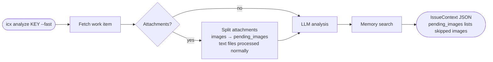
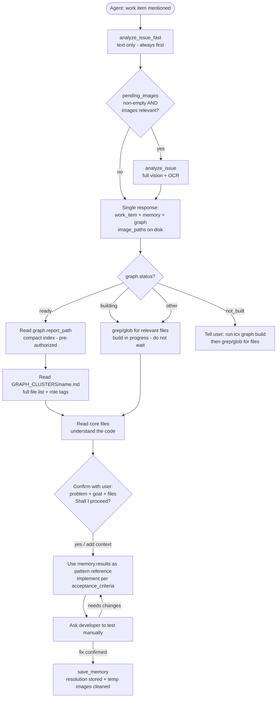

# ICX - Integrated Contextual X-ecution Engine

**AI-native intelligence layer for development teams.** Deep context extraction, local-first RAG memory, multi-modal analysis, and codebase knowledge graph. Securely bridge your work tracker to your AI agents via MCP.

[](https://pypi.org/project/icx-engine/)
[](https://pypi.org/project/icx-engine/)
[](./license)
[](https://github.com/althaf-space/icx-engine/releases)

> **ICX is under active development.** Features ship frequently. The API surface is stabilising. See the [changelog](#changelog--releases) for what changed in each release, and watch the repo to get notified of new versions.

---

ICX reaches into your work tracker, reads every item at full depth - title, description, comments, attachments, screenshots, spreadsheets - and delivers structured, high-fidelity context your AI can act on immediately.

Run `icx analyze` from your terminal for instant structured output. Register ICX as an MCP tool in your AI editor and let your agent call it automatically. Local memory captures every resolution so past fixes surface the next time a similar problem appears.

**Currently supports:** Jira Cloud

---

## What's being built

ICX is an early-stage product. The core pipeline (fetch → process → analyse → memory) is stable and used in production. The areas below are actively worked on:

| Area | Current state | Coming next |
|------|--------------|-------------|
| Connectors | Jira Cloud (stable) | GitHub Issues, Linear |
| LLM providers | Anthropic, OpenAI, Google, Ollama, NIM, xAI | Provider-level prompt caching |
| Attachments | PDF, DOCX, XLSX, CSV, images via OCR + vision | Audio/video transcription |
| Memory | Local LanceDB + ONNX embeddings (BAAI/bge-small-en-v1.5, no PyTorch) | Team-shared memory, conflict resolution |
| MCP tools | `analyze_issue_fast`, `analyze_issue`, `save_memory` | Batch analysis, project-level summary |
| Codebase graph | Project registration, AST + semantic build, staleness detection, compact index + per-cluster files + role tags + LLM descriptions | Multi-project graph, incremental rebuild |

If something does not work as expected, [open an issue](https://github.com/althaf-space/icx-engine/issues). Fixes ship fast.

---

## How ICX works

ICX operates in three modes depending on how you call it and what you have configured.

**CLI mode** - run `icx analyze KEY` from your terminal. ICX fetches the work item, processes every attachment, runs your configured AI model, queries local memory for similar past resolutions, and prints a structured JSON summary to stdout.

**MCP mode** - your AI editor calls ICX directly during a conversation. ICX exposes three tools. The agent calls `analyze_issue_fast` first - it returns structured analysis, memory results, and the codebase graph navigation map in a single response. The agent reads the compact graph index, opens the relevant cluster file, reads core files, then presents a confirmation summary before writing any code. You confirm (or add context), the agent implements, and saves the resolution when you confirm it works.

**MCP headless mode** - same as MCP mode but with no AI provider configured. ICX returns all raw content - text, attachment extracts, and image file paths - directly to your editor's AI for analysis. No separate API key required.

---

## Flows

### CLI - full analysis


### CLI - fast mode

Skip image processing and get text-only output immediately. Image filenames are preserved in `pending_images` so nothing is lost.



### MCP - agent flow with AI provider



### MCP headless - no AI provider


---

## Install

**Version:** 0.3.3 &nbsp;|&nbsp; **Requires Python 3.11, 3.12, 3.13, 3.14, or 3.15**

```
pipx install icx-engine
```

The first time you run any `icx memory` command, ICX downloads a small local embedding model (~24 MB) for memory search. This happens once with a live progress bar. Every subsequent command starts instantly.

**Optional - OCR for image attachments:**

| Platform | Command |
|----------|---------|
| Windows | `winget install UB-Mannheim.TesseractOCR` |
| macOS | `brew install tesseract` |
| Linux | `apt install tesseract-ocr` |

Without Tesseract, images are still processed via your AI provider's vision model if configured. ICX shows a one-time warning and continues normally.

**Uninstalling:** Use `icx uninstall` instead of bare `pip uninstall` - it removes all data, credentials, editor configs, and the package in one step.

---

## Quick start

```sh
# 1. Connect your work tracker
icx connection --add

# 2. Add an AI provider (for full analysis)
icx model --add

# 3. Analyse a work item
icx analyze PROJ-456
```

ICX works without an AI provider in MCP mode - your editor's AI handles the analysis directly.

---

## All commands

### Analysis

```sh
icx analyze <KEY>
icx analyze <KEY> --fast                       # skip image processing
icx analyze <KEY> --profile NAME               # use a specific LLM profile for this run
icx analyze <KEY> --profile NAME --fast        # profile + skip image processing
icx analyze <KEY> --path PATH                  # show graph status for a codebase path
icx analyze <KEY> --path P1 --path P2          # show graph status for multiple paths
icx analyze <KEY> --debug                      # show step-by-step pipeline output
icx analyze <KEY> --traceback                  # show full Python traceback on error
```

`KEY` can be a bare issue key (`PROJ-456`) or a full URL (`https://company.atlassian.net/browse/PROJ-456`).

Image attachments are written to `~/.icx/temp/<key>/` and returned as `image_paths` in the JSON output. No base64 in the output.

| Flag | What it does |
|------|-------------|
| `--fast` | Skip image processing. Images are listed in `pending_images`. Text attachments (PDF, Excel, Word) are still processed. |
| `--profile NAME` | Use a specific AI profile without changing your default. Combinable with `--fast`. |
| `--path PATH` | Show graph status for a codebase path after the analysis. Repeatable - pass multiple `--path` flags for multi-repo issues. Shows READY/BUILDING/NOT BUILT/NOT REGISTERED for each path. |
| `--debug` | Print each pipeline step to stderr as it runs. |
| `--traceback` | Show full Python traceback on error. |

### Connections

```sh
icx connection --add                       # connect a new account
icx connection --remove DOMAIN             # remove by domain
icx connection --remove INDEX              # remove by index from icx status
icx connection --active DOMAIN             # set default connection
icx connection --active INDEX              # set default by index
```

### LLM profiles

```sh
icx model --add                            # add a new AI profile
icx model --remove PROFILE                 # remove entire profile by name
icx model --remove INDEX                   # remove profile by index from icx status
icx model --remove PROFILE --channel <CHANNEL> # remove only the image/vision channel (text or image)
icx model --active PROFILE                 # set active profile
```

Supported providers: OpenAI, Anthropic (Claude), Google (Gemini), xAI (Grok), Ollama / LM Studio, Nvidia NIM.

### Memory

```sh
icx memory save <KEY>
icx memory save <KEY> --note "Fixed by updating TTL" --files "auth/token.py" --confirmed
icx memory search "OAuth token expires"
icx memory list
icx memory list --project PROJ
icx memory list --source jira
icx memory show <KEY>
icx memory delete <KEY>
icx memory export
icx memory export --output backup.json
icx memory import backup.json
icx memory clear --confirm
icx memory status
```

### Codebase graph

```sh
icx graph add --name NAME --path PATH   # register a project directory for graph analysis
icx graph build NAME               # build (or rebuild) the knowledge graph for a project
icx graph build NAME --force       # rebuild even if graph is current
icx graph list                     # list all registered projects with status and file counts
icx graph status NAME              # detailed status: build state, last commit, staleness info
icx graph remove NAME              # remove a project and its graph data
icx graph remove NAME --keep-cache # remove project but keep cached graph files
```

Graph data (including build cache) is stored in `~/.icx/graphs/` - nothing is written inside your project directories.

### MCP server

```sh
icx mcp setup                    # register ICX with detected AI editors
icx mcp setup --host claude      # register with a specific editor
icx mcp remove                   # remove ICX from all detected editors
icx mcp remove --host claude     # remove from a specific editor only
icx mcp config                   # print copy-paste config snippets
icx mcp list                     # list all supported editors and detection status
icx mcp run                      # start the MCP server (editors call this automatically)
```

### General

```sh
icx status       # show all connections and AI profiles
icx logout       # remove all credentials from this machine
icx uninstall    # fully remove ICX - data, credentials, editor configs, package
icx --version
icx --help
```

---

## Memory - your personal knowledge base

Every team solves the same problems more than once. ICX memory captures what you learned and surfaces it automatically the next time a similar item appears.

### How it works

1. You fix and test a work item.
2. You run `icx memory save PROJ-456`.
3. ICX asks: what was the fix? which files changed? any tags?
4. ICX stores your answer locally.
5. The next time you run `icx analyze` on a similar item, ICX runs a hybrid semantic + keyword search and adds a "Past Insights" panel to the output with similarity scores.

Memory queries use the LLM-analysed fields from the output (`problem_summary`, `detailed_description`) rather than raw tracker text - this gives much higher quality matches even when the wording of the new item differs from how you described the old one.

### Saving a resolution

```sh
icx memory save PROJ-456

# Or non-interactively:
icx memory save PROJ-456 \
  --note "Increased JWT TTL from 1h to 24h" \
  --files "src/auth/token.py" \
  --tags "jwt,auth" \
  --confirmed
```

### Privacy

Memory data lives in `~/.icx/memory/` on your machine only. The directory is locked to your user account (mode `0700`). ICX never sends memory data to any server. The `icx memory export` command writes a JSON file you can review before sharing.

---

## Using ICX with AI editors (MCP)

`icx mcp setup` registers ICX in your AI editor. ICX detects which editors are installed (Claude Code, Cursor, Windsurf, Codex, Gemini/Antigravity) and adds itself to each one automatically.

```sh
icx mcp setup                       # all detected editors
icx mcp setup --host claude         # Claude Code only
icx mcp setup --host antigravity    # Gemini CLI only
```

After setup, restart your editor. ICX will appear in its list of available tools.

### The MCP tools

| Tool | When the agent calls it |
|------|------------------------|
| `analyze_issue_fast` | Always first - text-only, fast. Returns `work_item` (analysis + `image_paths`), `memory` (past similar work), and `graph` (report path or build status) in a single response. When `project_paths` has more than one entry, also returns `graphs` (per-path status list). |
| `analyze_issue` | Only when `work_item.analysis.pending_images` is non-empty AND images are relevant to the problem. Pass the same `project_paths` as the fast call. |
| `save_memory` | After the developer confirms the fix is tested and working. Cleans up temp images for that issue. |

**Multi-repo support:** Pass `project_paths` as a list. Two modes the agent must follow:
- **User named specific repos** ("fix the auth service and UI") - agent resolves those paths and passes them: `project_paths: ["/projects/auth-svc", "/projects/ui"]`. Do not include the workspace root.
- **User named no specific repo** - agent passes the open workspace root: `project_paths: ["/projects/my-app"]`.

ICX returns `graph` (primary path, backward-compat) and `graphs[]` (all paths, only when more than one path passed) with per-path status - READY, BUILDING, NOT BUILT, or NOT REGISTERED. The agent uses available graphs and informs the user about paths that still need `icx graph build`.

### With and without an AI provider

With a provider configured, ICX returns a fully analysed `IssueContext` with problem summary, reproduction steps, acceptance criteria, confidence scores, and past insights. Image attachments are written to `~/.icx/temp/<key>/` and their paths returned in `work_item.image_paths` - keeping the JSON response compact so editors do not truncate it.

Without a provider, ICX falls back to raw mode in MCP. It returns `RawIssueResponse` with all raw text, processed attachment content, and image paths - your editor's AI analyses it directly.

---

## Privacy and security

- Credentials (API keys, OAuth tokens) are stored in your OS keyring, not in config files.
- Memory data stays in `~/.icx/memory/` on your machine only.
- ICX never sends your work item data, credentials, or memory to any third-party server.
- All network calls go directly to your work tracker and your configured AI provider.
- The config file at `~/.icx/config.json` contains no secrets - only profile names and domains.

See [security.md](./security.md) for the full security architecture and how to report vulnerabilities.

---

## Changelog / releases

See [GitHub Releases](https://github.com/althaf-space/icx-engine/releases) for the full changelog. Major changes are noted there for every version.

ICX follows a rolling release cadence - bug fixes and new connector support ship as soon as they are stable rather than waiting for a scheduled release window.

---

## Contributing

Contributions are welcome - new connectors, bug fixes, test coverage, and documentation improvements all make a real difference.

- **Bug reports and feature requests:** [open an issue](https://github.com/althaf-space/icx-engine/issues)
- **Code contributions:** see [contributing.md](./contributing.md) for setup instructions, code standards, and how to submit a PR
- **New connectors** (GitHub Issues, Linear, GitLab, etc.) are the highest-value contributions right now - the base interface is small and the rest of the pipeline works automatically

---

## License

Proprietary. See [license](./license) for terms.
