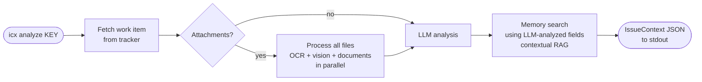
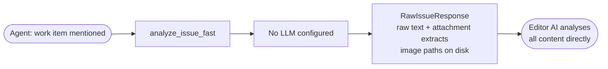
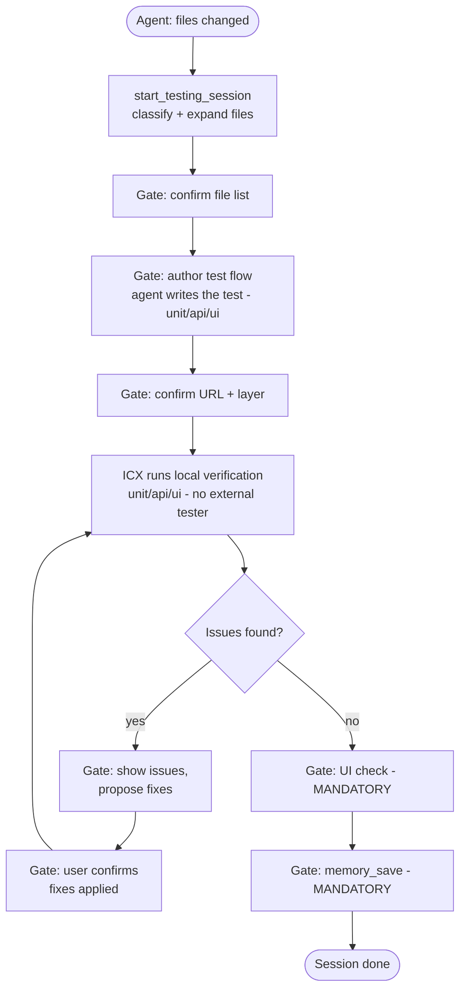
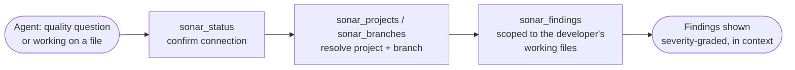
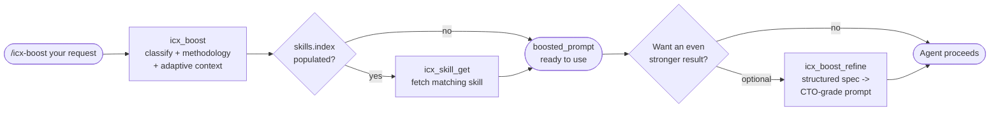
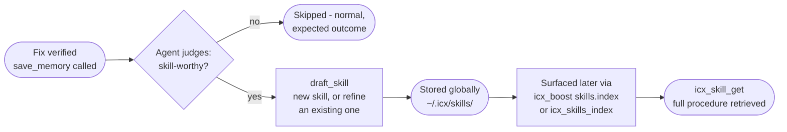
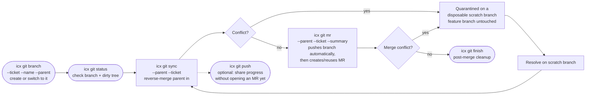
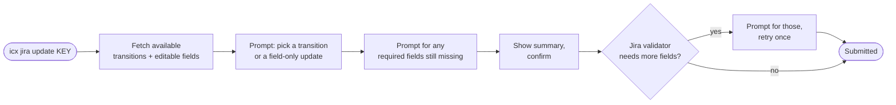
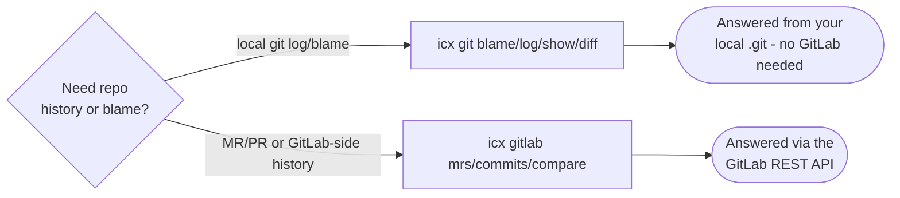

# ICX - Integrated Contextual X-ecution Engine

**AI-native intelligence layer for development teams.** Deep context extraction, multi-modal analysis, local-first RAG memory, a multi-language codebase knowledge graph, SonarQube code-quality insights, AI-assisted testing, a full confirmation-gated git/GitLab workflow (branch, commit, MR, tag), and Workstatus time-tracking. Securely bridge your work tracker, git host, and time-tracking tool to your AI agents via MCP.

[](https://pypi.org/project/icx-engine/)
[](https://pypi.org/project/icx-engine/)
[](./license)
[](https://github.com/althaf-space/icx-engine/releases)

> **ICX is under active development.** Features ship frequently. The API surface is stabilising. See the [changelog](#changelog--releases) for what changed in each release, and watch the repo to get notified of new versions.

---

ICX reaches into your work tracker, reads every item at full depth - title, description, comments, attachments, screenshots, spreadsheets, audio recordings, screen-capture videos - and delivers structured, high-fidelity context your AI can act on immediately.

Run `icx analyze` from your terminal for instant structured output. Register ICX as an MCP tool in your AI editor and let your agent call it automatically. Local memory captures every resolution so past fixes surface the next time a similar problem appears.

**Currently supports:** Jira Cloud as a work tracker; GitLab for the git-workflow automation (branch/commit/MR/tag, all confirmation-gated) and read-only repo lookups; Workstatus for time-tracking/attendance.

---

## What's being built

ICX is an early-stage product. The core pipeline (fetch -> process -> analyse -> memory) is stable and used in production. The areas below are actively worked on:

| Area | Current state | Coming next |
|------|--------------|-------------|
| Connectors (work trackers) | Jira Cloud (stable) | GitHub Issues, Linear |
| Integrations (git host / time-tracking) | GitLab (stable) - full confirmation-gated git-workflow lifecycle (branch/commit/stash/fetch/pull/sync/reverse-merge/MR with polled mergeability/tag/retag/delete-tag/delete-branch/line-level conflict inspection and gated take-ours/take-theirs/apply-resolution/mark-resolved/abort resolution, working regardless of what started the conflict; configurable branch-name policy; git-VCS dependency-pin staleness analysis across package.json/requirements.txt/pyproject.toml) plus read-only repo lookups (tags/branches/pipelines/jobs); Workstatus (stable) - time-tracking/attendance/timesheets, reverse-engineered API (no public docs) | Bitbucket, GitHub Actions/PRs |
| LLM providers | Anthropic, OpenAI, Google, Ollama, NIM, xAI | Provider-level prompt caching |
| Attachments | PDF (incl. scanned/OCR), DOCX, XLSX, XLS, PPTX, CSV, ZIP, code/text/config files, images via OCR + vision, audio (MP3/WAV/M4A/OGG/FLAC/AAC/Opus) + video (MP4/MOV/AVI/MKV/WebM, full-duration frame sampling) via local Whisper or LLM-native transcription | Speaker diarisation, language hints |
| Memory | Local LanceDB + ONNX embeddings (BAAI/bge-base-en-v1.5, 768-dim, no PyTorch) | Team-shared memory, conflict resolution |
| MCP tools | `icx_boost`, `icx_boost_refine`, `icx_skill_get`, `icx_skills_index`, `draft_skill`, `create_skill`, `analyze_issue_fast`, `analyze_issue`, `memory_search`, `memory_delete`, `memory_update`, 4 historical memory tools, `save_memory`, `record_verification`, `reinforce_memory_usage`, `get_memory_audit`, 3 testing tools (`start_testing_session`, `resume_testing_session`, `get_testing_session_status`), 1 methodology tool (`get_methodology`), 1 spec-lock tool (`lock_plan`), 2 UI-auth tools (`ui_auth_capture`, `ui_auth_inline`), 22 Sonar tools (`sonar_status`, `sonar_projects`, `sonar_branches`, `sonar_measures`, `sonar_quality_gate`, `sonar_findings`, `sonar_report`, `sonar_top_files`, `sonar_history`, `sonar_analyses`, `sonar_rule`, `sonar_rules`, `sonar_hotspot`, `sonar_source`, `sonar_metrics`, `sonar_quality_gate_definition`, `sonar_quality_profiles`, `sonar_issue_authors`, `sonar_issue_tags`, `sonar_issue_changelog`, `sonar_system_health`, `sonar_languages`), 39 git-workflow tools (`git_repo_status`, `git_start_branch`, `git_blame`, `git_log`, `git_show_commit`, `git_diff`, `git_diff_worktree`, `git_stage_and_commit`, `git_push`, `git_reverse_merge`, `git_get_conflict`, `git_read_file_at_ref`, `git_complete_resolution`, `git_adopt_resolution`, `git_discard_scratch`, `git_create_mr`, `git_finish_ticket`, `git_create_tag`, `git_delete_tag`, `git_retag`, `git_stash_create`, `git_stash_list`, `git_stash_apply`, `git_stash_pop`, `git_stash_drop`, `git_fetch`, `git_pull`, `git_sync`, `git_delete_branch`, `git_get_conflict_details`, `git_conflict_take_ours`, `git_conflict_take_theirs`, `git_conflict_apply_resolution`, `git_conflict_mark_resolved`, `git_conflict_abort`, `git_check_branch_name_policy`, `git_set_branch_policy`, `git_check_dependency_pins`, `git_restore_files`), 9 GitLab tools (`gitlab_list_merge_requests`, `gitlab_mr_changes`, `gitlab_list_commits`, `gitlab_compare`, `gitlab_list_tags`, `gitlab_list_branches`, `gitlab_list_pipelines`, `gitlab_pipeline_status`, `gitlab_job_log`), 25 Workstatus tools (`workstatus_unread_notifications`, `workstatus_my_profile`, `workstatus_add_timesheet`, `workstatus_list_projects`, `workstatus_get_project`, `workstatus_project_budget_analytics`, `workstatus_list_tasks`, `workstatus_list_task_statuses`, `workstatus_list_milestones`, `workstatus_list_task_checklist`, `workstatus_list_members`, `workstatus_list_teams`, `workstatus_attendance_list`, `workstatus_attendance_stats`, `workstatus_list_timesheets`, `workstatus_list_timesheet_clients`, `workstatus_weekly_report`, `workstatus_timesheet_submission_kpis`, `workstatus_timesheet_submission_table`, `workstatus_list_expenses`, `workstatus_list_invoices`, `workstatus_payroll_report`, `workstatus_get_timesheet`, `workstatus_edit_timesheet`, `workstatus_recent_project_tasks`), 26 Jira write-back tools (`jira_get_close_requirements`, `jira_list_issue_types`, `jira_get_createmeta_fields`, `jira_apply_update`, `jira_create_issue`, `jira_delete_issue`, `jira_comment_list`, `jira_comment_add`, `jira_comment_edit`, `jira_comment_delete`, `jira_search`, `jira_get_issue`, `jira_link_types`, `jira_link_create`, `jira_link_delete`, `jira_set_assignee`, `jira_search_assignable_users`, `jira_attachment_upload`, `jira_attachment_delete`, `jira_get_current_user`, `jira_list_watchers`, `jira_list_worklogs`, `jira_set_watcher`, `jira_worklog_add`, `jira_worklog_edit`, `jira_worklog_delete`) (157 total) | Batch analysis, project-level summary |
| Codebase graph | Project registration, AST + semantic build, LSP-powered edge resolution (Pyright, TypeScript, Jedi, Java symbols), JSP/Servlet, Go, C#, PHP, Rust, C++, Swift, Elixir, Scala, Rails, Angular, gRPC/Protobuf, Terraform/HCL, event broker detection (Kafka, RabbitMQ, Redis, SQS, SNS, NATS), co-change history, gopls/kotlin-language-server/rust-analyzer/OmniSharp/intelephense/clangd compiler-grade edges, incremental rebuild (SHA-256 hashing), multi-source edge fusion, PageRank + betweenness centrality, blast radius, cycle detection, dead code, CODEOWNERS integration, staleness detection, .icxignore exclusions, compact index + per-cluster files + role tags + LLM descriptions, GraphQuerier API | Multi-project graph, team-shared graph cache |
| Default skills | 15 pre-installed best-practice skills (debugging, TDD, planning, minimal-diff discipline, verification, code review, UI/UX accessibility, comprehensive test authoring, plus one per major ICX tool - Sonar, tickets, git, graph, testing, memory), seeded automatically into `~/.icx/skills/` on first MCP connection or `icx setup`/`icx update` - reachable from any connected AI coding agent, no per-editor setup | Community-contributed default skills |

If something does not work as expected, [open an issue](https://github.com/althaf-space/icx-engine/issues). Fixes ship fast.

---

## How ICX works

ICX operates in three modes depending on how you call it and what you have configured.

**CLI mode** - run `icx analyze KEY` from your terminal. ICX fetches the work item, processes every attachment, runs your configured AI model, queries local memory for similar past resolutions, and prints a structured JSON summary to stdout.

**MCP mode** - your AI editor calls ICX directly during a conversation. ICX exposes a set of MCP tools; the agent calls `analyze_issue_fast` first - it returns structured analysis, memory results, and the codebase graph navigation map in a single response. The agent reads the compact graph index, opens the relevant cluster file, reads core files, then presents a confirmation summary before writing any code. You confirm (or add context), the agent implements, and saves the resolution when you confirm it works.

**MCP headless mode** - same as MCP mode but with no AI provider configured. ICX returns all raw content - text, attachment extracts, and image file paths - directly to your editor's AI for analysis. No separate API key required.

---

## Flows

### CLI - full analysis



### CLI - fast mode

Skip all attachment processing and get text-only output immediately. Skipped filenames are preserved in `pending_images` (images), `pending_audio` (audio + video), `pending_documents` (PDF/DOCX/XLSX/XLS/PPTX/CSV/ZIP/code+text files), and `pending_unsupported` (other types) so nothing is lost.


### MCP - agent flow with AI provider


### MCP headless - no AI provider



### Testing - agent-driven local verification



### Sonar - code-quality lookup



### Boost - methodology-driven prompt



### Skills - learned procedures, reused across projects



**Default skills, seeded automatically.** Alongside skills you or your team learn over time, ICX ships 14 curated best-practice skills - debugging, TDD, planning, minimal-diff discipline, verification, code review, UI/UX accessibility, comprehensive test authoring, and one per major ICX tool (Sonar, tickets, git, graph, testing, memory). They're seeded into `~/.icx/skills/` the first time your MCP client connects (or via `icx setup`/`icx update`), and never overwritten once you customize one. They reach the agent two ways: ranked in every `icx_boost` call, and attached directly to `start_testing_session`, `sonar_status`, `analyze_issue_fast`, and `git_repo_status` responses - so the matching skill shows up even when an agent never calls `icx_boost` at all.

### Git workflow - branch to merge



`icx git tag` is deliberately not part of this lifecycle diagram - tagging always asks which branch to tag from, every time, since it's an occasional, higher-stakes action rather than a step in the ticket-to-merge loop above. `icx git push` is likewise shown as an optional side path, not a required step - `icx git mr` already pushes the feature branch automatically before creating the MR.

### Jira write-back - closing out a ticket



### Git & GitLab - history and blame



---

## Install

**Version:** 0.6.4 &nbsp;|&nbsp; **Requires Python 3.11, 3.12, 3.13, or 3.14**

```
pipx install icx-engine
```

The first time you run `icx setup`, ICX downloads a local embedding model (~110 MB) for memory search. This happens once with a live progress bar. Every subsequent start is instant.

After upgrading ICX, run `icx update` to apply any new config defaults and initialise new storage components.

**Optional - OCR for image attachments:**

| Platform | Command |
|----------|---------|
| Windows | `winget install UB-Mannheim.TesseractOCR` |
| macOS | `brew install tesseract` |
| Linux | `apt install tesseract-ocr` |

Without Tesseract, images are still processed via your AI provider's vision model if configured. ICX shows a one-time warning and continues normally.

**Audio and video transcription** ships bundled - `faster-whisper` (~145 MB base model, downloaded once on first audio attachment to `~/.icx/audio/model/`) and the static `imageio-ffmpeg` binary for video -> audio extraction. No system packages required. With OpenAI configured, ICX uses the Whisper API (large-v2 accuracy); with Google, it uses Gemini native audio; otherwise it transcribes locally and routes the result through your text LLM for cleanup.

**Uninstalling:** Use `icx uninstall` instead of bare `pip uninstall` - it removes all data, credentials, editor configs, and the package in one step.

---

## Quick start

```sh
# 1. Connect your work tracker
icx connection --add

# 2. Add an AI provider (for full analysis)
icx model --add

# 3. Analyse a work item
icx analyze PROJ-456
```

ICX works without an AI provider in MCP mode - your editor's AI handles the analysis directly.

---

## All commands

### Analysis

```sh
icx analyze <KEY>
icx analyze <KEY> --fast                       # skip image processing
icx analyze <KEY> --profile NAME               # use a specific LLM profile for this run
icx analyze <KEY> --profile NAME --fast        # profile + skip image processing
icx analyze <KEY> --path PATH                  # show graph status for a codebase path
icx analyze <KEY> --path P1 --path P2          # show graph status for multiple paths
icx analyze <KEY> --debug                      # show step-by-step pipeline output
icx analyze <KEY> --traceback                  # show full Python traceback on error
```

`KEY` can be a bare issue key (`PROJ-456`) or a full URL (`https://company.atlassian.net/browse/PROJ-456`).

Image attachments are written to `~/.icx/temp/<key>/` and returned as `image_paths` in the JSON output. No base64 in the output. Audio and video transcripts are inlined into `attachment_texts` under the original filename.

| Flag | What it does |
|------|-------------|
| `--fast` | Skip all attachment processing (images, audio/video, documents). AI still analyzes issue text and comments. Skipped files listed in `pending_images`, `pending_audio`, `pending_documents`, or `pending_unsupported` depending on type. |
| `--profile NAME` | Use a specific AI profile without changing your default. Combinable with `--fast`. |
| `--path PATH` | Show graph status for a codebase path after the analysis. Repeatable - pass multiple `--path` flags for multi-repo issues. Shows READY/BUILDING/NOT BUILT/NOT REGISTERED for each path. |
| `--debug` | Print each pipeline step to stderr as it runs. |
| `--traceback` | Show full Python traceback on error. |

### Connections

```sh
icx connection --add                       # connect a new account
icx connection --remove DOMAIN             # remove by domain
icx connection --remove INDEX              # remove by index from icx status
icx connection --active DOMAIN             # set default connection
icx connection --active INDEX              # set default by index
```

**If you connected Jira via OAuth before this version:** re-run `icx connection --add` -> Jira -> OAuth PKCE and re-consent. ICX now requests the `write:jira-work` scope (needed for `icx jira update` / `jira_apply_update`) in addition to the existing read scopes, and an already-issued access/refresh token pair keeps whatever scope it was originally granted - it will not gain write access on its own. This only affects OAuth connections; API-token (email + token) connections are unaffected.

### LLM profiles

```sh
icx model --add                            # add a new AI profile
icx model --remove PROFILE                 # remove entire profile by name
icx model --remove INDEX                   # remove profile by index from icx status
icx model --remove PROFILE --channel <CHANNEL> # remove only the image/vision channel (text or image)
icx model --active PROFILE                 # set active profile
```

Supported providers: OpenAI, Anthropic (Claude), Google (Gemini), xAI (Grok), Ollama / LM Studio, Nvidia NIM.

### Memory

```sh
icx memory save <KEY>
icx memory save <KEY> --note "Fixed by updating TTL" --files "auth/token.py" --confirmed
icx memory search "OAuth token expires"
icx memory list
icx memory list --project PROJ
icx memory list --source jira
icx memory show <KEY>
icx memory update <KEY>
icx memory delete <KEY>
icx memory export
icx memory export --output backup.json
icx memory import backup.json
icx memory clear --confirm
icx memory status
icx memory migrate
icx memory by-file <PATH>
icx memory by-file <PATH> --project PROJ
icx memory hotspots
icx memory hotspots --project PROJ --top 10
icx memory related <KEY>
icx memory related <KEY> --project PROJ
icx memory patterns
icx memory patterns --project PROJ
```

### Skills

Skills are learned, reusable procedures - distilled from your verified fixes, not tied to any one ticket. Memory answers "have we seen this exact ticket before"; skills answer "do we already know how to do this kind of thing" - when to use the approach, the step-by-step procedure, pitfalls to avoid, and how to verify it worked. Because skills are stored globally (`~/.icx/skills/`), not per-project, a skill learned fixing an OAuth bug in one repo shows up again the next time a different repo hits the same class of problem.

Skills are created automatically: after every `icx memory save` (or the MCP equivalent, `save_memory`), the connected agent judges for itself whether the fix is skill-worthy and, if so, drafts one via `draft_skill` - or refines an existing skill covering the same ground, so near-duplicates don't pile up. `skill_worthy=false` is a normal, expected outcome for a one-off fix. For a general-purpose skill that isn't following up a verified fix, write one by hand with `icx skills create`, or ask a connected agent to call the MCP-equivalent `create_skill` tool directly - neither requires a ticket or a memory entry.

ICX surfaces relevant skills back to the agent on its own - during `/icx-boost` (as `skills.index`), right after a memory save (as `related_skills`), and via the full unfiltered `icx_skills_index` catalog as a safety net - so a skill learned once keeps paying off without anyone having to remember it exists or re-discover the fix from scratch.

```sh
icx skills list                       # list every skill ICX has learned from verified fixes
icx skills create                     # create a skill by hand - no ticket required
icx skills delete <NAME>              # delete one skill
```

Alongside skills you learn yourself, ICX also ships 15 pre-installed default skills - agent-agnostic engineering practices (debugging, TDD, planning, minimal-diff discipline, verification, code review), a UI/UX accessibility baseline, a comprehensive test-authoring skill, and one skill per major ICX tool (Sonar, tickets, git, graph, testing, memory). These are seeded automatically into `~/.icx/skills/` on first MCP connection and by `icx setup`/`icx update` - no manual step required, and a customized default is never overwritten by a later ICX update.

### Codebase graph

```sh
icx graph add --name NAME --path PATH --project KEY   # register a project directory (--project required, e.g. a Jira project key like PROJ)
icx graph build NAME               # build (or rebuild) the knowledge graph for a project
icx graph build --project KEY      # build all graphs tagged with this tracker project key (case-insensitive)
icx graph build NAME --force       # rebuild even if graph is current
icx graph list                     # list all registered projects with status and file counts
icx graph status NAME              # detailed status: build state, last commit, staleness info
icx graph remove NAME              # remove a project and its graph data
icx graph remove NAME --keep-cache # remove project but keep cached graph files
```

Graph data (including build cache) is stored in `~/.icx/graphs/` - nothing is written inside your project directories.

### Git workflow

```sh
icx git status                        # current branch, dirty files, leftover state from an interrupted run
icx git branch --ticket ABC-123 --name "Fix login timeout" --parent main  # create a feature branch (or switch to it if it already exists)
icx git sync --parent main --ticket ABC-123  # reverse-merge parent in; quarantines conflicts on a scratch branch, never your feature branch
icx git push --remote origin   # plain push of the current branch, no force, no rebase - prompts to confirm before pushing; `icx git mr` already does this automatically
icx git mr --parent main --ticket ABC-123 --summary "Fix login timeout"   # create/reuse MR, attempt immediate merge
icx git finish --parent main --feature feature/fix-login-timeout-ABC-123 --ticket ABC-123 --mr-iid 5   # post-merge cleanup
icx git tag --env qa --branch main   # shows previous tag for 'qa', proposes the next one, hard-gates approval before creating
icx git blame src/app.py --from-line 10 --to-line 20   # per-line commit sha, author, content (both line flags optional, must be given together)
icx git log --file src/app.py --author althaf --since "2 weeks ago" --limit 10   # commit history, newest first
icx git show a1b2c3d4   # full commit detail - message plus changed files
icx git diff main feature/x-ABC-1   # per-file status plus insertions/deletions between two refs
```

Ticket-to-merge lifecycle helper - branch setup, safe daily sync, explicit staged commits, and (once you're on a feature branch) opening the merge request. Feature branches are shared: no rebase, no force-push, ever - reconciliation always happens by merge. A conflicted merge never lands on your parent branch; conflicts are resolved on a disposable scratch branch, never on your real feature branch. `--parent` is optional on `branch`/`sync`/`mr`/`finish` - it is confirmed every time when omitted, never silently reused from a prior call; a repo's last-confirmed parent branch is offered as a fast one-tap default so re-confirming it is a single prompt, not a blind re-pick, and rejecting the default prompts for a new branch. `--parent` explicitly passed always wins and updates the remembered value. `icx git tag`'s `--branch` follows the same "always ask, saved value only as a default" rule and always did, since tagging is a deliberate, occasional, higher-stakes action. Full design: [docs/superpowers/specs/2026-07-26-icx-git-workflow-design.md](docs/superpowers/specs/2026-07-26-icx-git-workflow-design.md).

### Jira write-back

```sh
icx jira update <KEY>            # discover available transitions/required fields, prompt, confirm, apply
icx jira create                  # interactively create a new issue (project, issue type, summary, required fields)
icx jira delete <KEY>             # permanently delete an issue - shows an explicit no-undo/no-trash warning first
icx jira delete <KEY> --delete-subtasks  # also delete the issue's subtasks
icx jira comment list <KEY>      # list comments on an issue
icx jira comment add <KEY> <TEXT>    # add a plain-text comment
icx jira comment edit <KEY> <COMMENT_ID> <TEXT>  # edit an existing comment
icx jira comment delete <KEY> <COMMENT_ID>       # permanently delete a comment - explicit no-undo warning first
icx jira search <JQL>            # search issues by JQL, print matching keys/summaries (lightweight, raw)
icx jira get <KEY>                # print an issue's raw fields (lightweight, raw - not full LLM analysis)
icx jira link types               # list link types available for linking two issues (e.g. Blocks, Relates to)
icx jira link create <TYPE> <INWARD_KEY> <OUTWARD_KEY>  # link two issues together
icx jira link delete <ISSUE_KEY> <LINK_ID>  # remove a link - dependency-visibility warning, not a false permanence claim
icx jira assign <KEY> <ACCOUNT_ID>   # assign an issue to an account
icx jira assign <KEY> --unassign      # clear the assignee
icx jira assign <KEY> --default       # assign the project's default assignee
icx jira attach add <KEY> <FILE_PATH>          # upload a local file as an attachment
icx jira attach remove <ISSUE_KEY> <ATTACHMENT_ID>  # permanently delete an attachment - explicit no-undo warning first
icx jira whoami                       # print your own Jira identity (accountId, displayName)
icx jira watch add <KEY> [ACCOUNT_ID]     # add a watcher - self is immediate, another user asks to confirm first
icx jira watch remove <KEY> [ACCOUNT_ID]  # remove a watcher - self is immediate, another user asks to confirm first
icx jira worklog list <KEY>           # list worklog entries on an issue
icx jira worklog add <KEY> <SECONDS> <STARTED>  # log time against an issue - always logged as yourself
icx jira worklog edit <KEY> <WORKLOG_ID>        # edit a worklog entry - own is immediate, someone else's asks to confirm first
icx jira worklog delete <KEY> <WORKLOG_ID>      # delete a worklog entry - own is immediate, someone else's asks to confirm first
```

Interactively closes out or updates a Jira issue: fetches available workflow transitions and editable fields for the ticket, lets you pick a transition (or a field-only update), prompts for anything required that you haven't already given, shows a summary, and confirms before submitting. If Jira comes back asking for more fields (a workflow validator not visible in the initial requirements), you're prompted for those and it retries once. Requires an OAuth connection with the `write:jira-work` scope, or an API-token connection (token connections have no scope concept - Jira enforces permissions server-side per user).

`icx jira create` prompts for a project key, lists the issue types available for creation in that project, prompts for a summary, then fetches that issue type's create-time required fields and prompts for anything still missing before confirming and creating.

`icx jira delete <KEY>` always shows an explicit warning before asking for confirmation: Jira Cloud has no recycle bin for issues, so a deletion is permanent and cannot be undone. Pass `--delete-subtasks` if the issue has subtasks - Jira rejects the delete otherwise.

`icx jira comment delete` carries the same no-undo warning style as `icx jira delete` - Jira has no recovery mechanism for a deleted comment either.

`icx jira search`/`icx jira get` are lightweight, raw reads with no LLM analysis - not a replacement for `icx analyze`. Search is server-side cost-capped (`max_results` clamped to 100, a small default `fields` set when omitted).

`icx jira link delete` shows a warning too, but a deliberately different one from delete/comment-delete: a Jira issue link CAN be recreated after deletion, so the risk described is losing visibility of a real dependency between issues until someone notices and re-adds it - not permanent data loss.

`icx jira assign` sends Jira's raw `accountId` by default; `--unassign` sends `null` and `--default` sends Jira's `"-1"` default-assignee sentinel, so you never need to know that magic string yourself.

`icx jira attach remove` carries the same permanent/no-undo warning style as `icx jira delete`/`icx jira comment delete` - verified, Jira Cloud has no recycle bin for attachments either.

**Watchers and worklog carry a real self-vs-other permission check, not just a warning.** `icx jira watch add/remove` and `icx jira worklog edit/delete` first look up your own Jira identity (`GET .../myself`, exposed directly as `icx jira whoami`) and compare it against the target: acting on your own identity - watching an issue yourself, editing your own worklog entry - executes immediately, no confirmation needed. Acting on a DIFFERENT user's identity (an explicit `account_id` on watch, or someone else's worklog entry) shows an explicit warning and asks for confirmation first, the same way any destructive action does elsewhere in this CLI - even though the underlying Jira call is technically no more dangerous either way. `icx jira worklog add` is the one exception with no self-vs-other branch at all: Jira's worklog creation endpoint has no author-override field, a new entry is always attributed to the authenticated caller, so there is no "on behalf of someone else" case to check for.

### GitLab

ICX connects to GitLab to create and merge your ticket's MR once your feature branch is ready. Separate from your work tracker (Jira) - GitLab is where your code review happens, Jira is where the ticket lives. You can register multiple servers with one active, exactly like AI profiles and Sonar connections.

```sh
icx gitlab --add               # add a server connection (name, URL, token, TLS verify); first becomes active; validates live
icx gitlab --list              # list connections and which is active (bare `icx gitlab` also lists)
icx gitlab --active <name>     # set the active connection
icx gitlab --remove <name>     # remove a connection (clears its keyring token)
icx gitlab verify              # re-check the active connection, list a few accessible projects
icx gitlab status              # show the active connection status
icx gitlab mrs --state merged --target-branch main --limit 10   # list merge requests; --project optional, derived from the current repo's origin remote
icx gitlab commits --ref main --path src/app.py --since 2026-07-01   # commit history for a GitLab project
icx gitlab compare development feature/x-ABC-1   # file-level diff summary between two refs
```

`icx gitlab mrs`/`icx gitlab commits`/`icx gitlab compare` all accept `--project <namespace/project>` explicitly, or derive it automatically from the current directory's git origin remote when omitted.

Connections also show up in `icx status`.

ICX never overrides your team's merge/approval/pipeline rules - it attempts one immediate merge after creating the MR, and if GitLab's own protection rules refuse it, ICX reports the exact reason and stops. A human finishes the review in GitLab's own UI when that happens.

### Testing

```sh
icx test configure                            # set testing defaults (max fix-iteration limit)
icx test rules                                # show the per-gate rulebook (~/.icx/testing_rules); --reset re-seeds
icx test sessions                             # list all active testing sessions
icx test cancel <SESSION_ID>                  # cancel an active testing session
icx test analytics                            # render the run-history analytics dashboard (flakiness, pass-trend, slowest tests, heals); opt-in when ICX_TEST_ANALYTICS=1
```

**Local engine.** Verification runs fully in-process and async - there is no external tester to install or keep running. For `unit`/`api`, ICX detects the right runners for the layer and runs them on the repo-correct runtime; for `agent`, the connected editor agent runs its own Playwright test and ICX reads the result. Either way ICX reports one normalized result plus a Definition-of-Done confidence score. Agent tests run headless by default; at the URL gate you can choose a visible browser and a slowmo delay (default 1s when visible, 0 when headless) so the agent's own browser is watchable.

**Human-readable reports.** After each test run, ICX also writes a browser-viewable HTML report to `~/.icx/testing/reports/` (open `index.html` for a newest-first list of all runs) - the human view alongside the structured result your MCP agent gets. Every test expands to what it checked, how it ran, the pass criteria, and the result; a "Security scan" section lists all security findings by severity.

**Agent-authored, self-healing Playwright tests.** For `agent` runs, ICX first drives a per-framework Element Census (React/Angular/Vue/Svelte) that enumerates and reconciles every interactive element, field, validation, and message on the screen, then fuses it with a live crawl of the real page so every selector in it already resolves - so authoring misses nothing (the count reconciliation makes "nothing missed" verifiable). ICX hands that model, the target URL, the restored auth session, and its own pinned Playwright install to your connected editor agent, which writes a real Playwright test, runs it itself, reads Playwright's own failures, and fixes and re-runs its own script until a durable, user-editable checklist (`icx test rules`) is covered - no custom interpreter in between to misreport a real failure as "0 tests ran".

**NL/ticket-driven scenarios.** In agent mode, ICX can pass extra scenario guidance into the authoring gate from a plain-English intent (`nl_intent`) or a ticket's acceptance criteria (`acceptance_criteria`), both optional on `start_testing_session` - the connected editor agent authors and asserts a scenario for each as part of its own test.

**Fast path for re-testing a known screen.** Testing the same screen again normally redoes file discovery, the element census, and the compatibility scan - by default, every time. If ICX finds a prior cleared run of that exact screen where every cached file is still byte-identical AND a quick re-check finds no new related file, it offers a `known_screen` gate: reuse the cached scope/census and jump straight to URL/layer confirmation, or redo everything from scratch anyway. Any change at all to a cached file - or a genuinely new related file appearing - skips this gate entirely and just re-runs the full pipeline; there is no way to force the fast path when it isn't provably safe.

**ICX brings its own runners.** The test tooling ICX needs (Playwright for the agent layer, Schemathesis/Hurl for API, mutmut/Stryker for mutation, gotestsum/nextest bridges) is installed by ICX under `~/.icx/testing/<runner>/<version>/`, version-pinned - but only after you approve it. Run `icx test setup` to install it. Nothing installs silently (set `ICX_AUTO_INSTALL_RUNNERS=1` to opt in); if a runner is missing and not approved, that layer is reported unavailable rather than crashing. This is separate from your language SDKs, which ICX discovers and reuses (never installs). Only the agent layer needs Node (Playwright is Node-only) - and the harness Node is separate from your app's Node, so a Node-14/16 project still gets agent testing on a discovered Node 18+ (or set `ICX_HARNESS_NODE`); this is the same pinned install your connected agent is handed for its own test run, never a bare `npx`/global one. Full provisioning + air-gapped/offline guide: [docs/testing-setup.md](docs/testing-setup.md).

**Rulebook.** The mandatory rules the AI agent must follow at each testing gate live as editable Markdown in `~/.icx/testing_rules/` (one file per gate, seeded from bundled defaults on first use). ICX loads the relevant file and injects it into every gate, so the rules apply in every session and can't drift out of the agent's context - edit a file to change agent behavior on the next gate, no code change. For gate 2b (spec generation), ICX also enforces that every section listed in `2b.md` is present and re-asks the agent until the spec is complete, so an incomplete spec can never be silently submitted. Run `icx test rules` to see the files and the sections enforced.

**Security testing (DAST + SAST + secrets + SCA, native, no installer).** Security is not a separate tool you install - the checks run inside every test run, self-hosted and deterministic. Runtime (DAST): for `agent` runs, a durable checklist (`icx test rules`) mandates XSS/SQLi-shaped probes across every free-text input, including search/filter boxes, in the agent's own test; each API endpoint gets 8 injection classes (SQLi/NoSQL/command/template/path/LDAP/XPath/CRLF), mass-assignment, broken-auth, object-level (IDOR-adjacent) and response-security-header checks. Static (over your own source): a secrets scan (cloud keys, private keys, tokens, hardcoded credentials - masked in the report), SAST-lite (real Python AST + cross-language rules for `eval`/`exec`, `shell=True`, disabled TLS, SQL string-concat, `innerHTML`/`dangerouslySetInnerHTML`, wildcard CORS, weak hashes and more), and SCA (dependency manifests flagged for unpinned versions and matched against an optional offline advisory file - `ICX_SCA_ADVISORY` or `.icx-advisories.json`). Findings are severity-graded and shown in a dedicated "Security scan" section of the HTML report. Honest by design: rule/AST matching (not full taint-flow) and offline/manifest dependency checks (not a live CVE feed).

**Test-quality insight.** Every run also reports a "Test quality" section: which existing tests are relevant to your changed files (regression selection, from a read-only `git diff`), a before/after performance-regression comparison when you provide metrics (`ICX_PERF_BEFORE`/`ICX_PERF_AFTER`), and a mutation-testing score when you supply a mutation report (`ICX_MUTATION_REPORT`) - proving the unit tests actually catch bugs, not just run the code. Each shows real numbers when its inputs exist, or an honest "not run" with the reason - never a faked figure.

### Sonar (code quality)

ICX reads a SonarQube server directly over its Web API (read-only, no proxy) and hands structured, typed results to your AI agent. You can register multiple servers with one active, exactly like AI profiles - run `icx sonar add` to add one. The CLI is intentionally minimal; the rich surface is the MCP tools (see below), where the agent lists projects and branches, then scopes findings to the exact files a developer is working on.

```sh
icx sonar --add               # add a server connection (name, URL, token, TLS verify); first becomes active; validates live
icx sonar --list              # list connections and which is active (bare `icx sonar` also lists)
icx sonar --active <name>     # set the active connection
icx sonar --remove <name>     # remove a connection (clears its keyring token)
icx sonar status              # active connection + live connection health
icx sonar projects            # list projects the active token can access
icx sonar report --project <key> [--branch <b>] [--file <path>]...   # compact summary: gate + counts
```

Connections also show up in `icx status`.

### Workstatus (time tracking)

ICX connects to Workstatus (workstatus.io), a time-tracking/attendance SaaS with **no public API
documentation** - every endpoint this connector uses was reverse-engineered from live, authorized
browser network capture, never guessed. Only endpoints with a fully verified request+response
shape are implemented (24 so far, covering projects, tasks, milestones, members, teams,
attendance, timesheets (including edit), reports, and financials); see `developer.md` Section 6b
for the full evidence trail and the remaining catalogued-but-unimplemented endpoints. Multiple named
connections with one active, same as GitLab/Sonar - run `icx workstatus --add` and paste the four
session header values from your own browser's Network tab exactly as shown, including a `Bearer `
prefix on Authorization if one is present (it's sent through unmodified, never added or stripped;
the same shape as Jira's API-token connector, since Workstatus's login request body was never
captured either).

```sh
icx workstatus --add                       # add a connection (interactive, pasted from your browser)
icx workstatus --list                      # list connections and which is active (bare `icx workstatus` also lists)
icx workstatus --active <name|index>       # set the active connection
icx workstatus --remove <name|index>       # remove a connection (clears its keyring secrets)
icx workstatus status          # active connection status + unread notification count
icx workstatus profile         # your own Workstatus profile
icx workstatus unread          # your unread notification count
icx workstatus add-time --project-id <id> --todo-id <id> --date <DD-MM-YYYY> \
    --from <time> --to <time> --duration <dur> --reason <text>   # add a REAL timesheet entry

icx workstatus projects [--keyword <text>]                        # list projects
icx workstatus project --project-id <id>                          # one project's details
icx workstatus project-budget --project-id <id> [--quarter <q>]   # project budget/margin analytics
icx workstatus tasks --project-id <id> [--search <text>]          # list tasks for a project
icx workstatus task-statuses --project-id <id>                    # task statuses for a project
icx workstatus milestones --project-id <id>                       # milestones for a project
icx workstatus task-checklist --task-id <id>                      # checklist items for a task
icx workstatus members [--search-key <text>]                      # list members
icx workstatus teams                                              # list teams
icx workstatus attendance --start-date <d> --end-date <d>         # day-by-day attendance
icx workstatus attendance-stats --start-date <d> --end-date <d>   # summary attendance stats
icx workstatus timesheets --start-date <d> --end-date <d>         # logged timesheet entries
icx workstatus timesheet-clients                                  # clients billable via timesheets
icx workstatus weekly-report --start-date <d> --end-date <d>      # weekly hours/activity/earnings
icx workstatus submission-kpis --start-date <d> --end-date <d>    # timesheet submission KPIs
icx workstatus submission-table --start-date <d> --end-date <d> [--page <n>] [--per-page <n>]
icx workstatus expenses --start-date <d> --end-date <d>           # expenses for a date range
icx workstatus invoices [--search <text>]                          # list invoices
icx workstatus payroll --start-date <d> --end-date <d>             # payroll report
icx workstatus timesheet --timesheet-id <id>                       # one entry's full detail
icx workstatus edit-time --timesheet-id <id> --project-id <id> --todo-id <id> \
    --date <DD-MM-YYYY> --from <time> --to <time> --duration <dur> --reason <text> \
    --field-name <field> --previous-value <old> --new-value <new>   # edit a REAL entry
```

### MCP server

```sh
icx mcp setup                    # register ICX with detected AI editors
icx mcp setup --host claude      # register with a specific editor
icx mcp remove                   # remove ICX from all detected editors
icx mcp remove --host claude     # remove from a specific editor only
icx mcp config                   # print copy-paste config snippets
icx mcp list                     # list all supported editors and detection status
icx mcp run                      # start the MCP server (editors call this automatically)
```

### General

```sh
icx setup        # download AI model files (run once after install)
icx update       # apply config migrations and verify storage after a package upgrade
icx status       # show all connections and AI profiles
icx logout       # remove all credentials from this machine
icx uninstall    # fully remove ICX - data, credentials, editor configs, package
icx --version
icx --help
```

Every command accepts `--debug` (step-by-step progress to stderr) and `--traceback` (full Python traceback on error) for troubleshooting.

---

## Memory - your personal knowledge base

Every team solves the same problems more than once. ICX memory captures what you learned and surfaces it automatically the next time a similar item appears.

### How it works

1. You fix and test a work item.
2. You run `icx memory save PROJ-456`.
3. ICX asks: what was the fix? which files changed? any tags?
4. ICX stores your answer locally.
5. The next time you run `icx analyze` on a similar item, ICX runs a hybrid semantic + keyword search and adds a "Past Insights" panel to the output with similarity scores.

Memory queries use the LLM-analysed fields from the output (`problem_summary`, `detailed_description`) rather than raw tracker text - this gives much higher quality matches even when the wording of the new item differs from how you described the old one.

### Saving a resolution

```sh
icx memory save PROJ-456

# Or non-interactively:
icx memory save PROJ-456 \
  --note "Increased JWT TTL from 1h to 24h" \
  --files "src/auth/token.py" \
  --tags "jwt,auth" \
  --confirmed
```

### Privacy

Memory data lives in `~/.icx/memory/` on your machine only. The directory is locked to your user account (mode `0700`). ICX never sends memory data to any server. The `icx memory export` command writes a JSON file you can review before sharing.

---

## Using ICX with AI editors (MCP)

`icx mcp setup` registers ICX in your AI editor. ICX detects which editors are installed (Claude Code, Cursor, Windsurf, Codex, Antigravity, VS Code) and adds itself to each one automatically - it also installs each editor's native `/icx-boost` command and its ticket/testing/sonar routing.

```sh
icx mcp setup                       # all detected editors
icx mcp setup --host claude         # Claude Code only
icx mcp setup --host vscode         # VS Code only
```

After setup, restart your editor. ICX will appear in its list of available tools, and `/icx-boost` in its command list.

For every editor, `icx mcp setup` also installs ICX-first routing for the narrow, high-precision cases: a work-tracker ticket reference (a key like `ABC-123`, or a Jira/GitHub/Linear/GitLab issue URL), a testing request, or a SonarQube/code-quality request. On Claude Code it's a `UserPromptSubmit` hook plus a `CLAUDE.md` rule; on the other editors, an instruction written into that editor's global-rules file. All of it is removed by `icx mcp remove`.

**Windsurf users:** Windsurf was renamed Devin Desktop (Cognition, June 2026) and moved its MCP config file to a new location. `icx mcp setup --host windsurf` writes to the new location automatically and keeps the old `~/.codeium/windsurf/mcp_config.json` in sync too (some tooling still reads it); `icx mcp remove` cleans up both, including a stale entry left over from before this fix if you ran setup on an older ICX version.

### The MCP tools

**`/icx-boost` - on demand, one call, two passes.** Boost is not something the agent calls on every message - it runs only when you (or your editor's MCP-prompt auto-surfacing) explicitly invoke `/icx-boost <your request>`. One call classifies the task, applies the mandatory ICX methodology, gathers only the codebase context the problem needs (graph/grep/memory - skipped for a plain question or when no repo is connected), and auto-refines the result into a CTO-grade prompt in the same call - no second tool call needed. For a work-tracker ticket, `analyze_issue_fast` remains the ticket entrypoint, and that routing stays always-on (see above), independent of whether boost was invoked.

| Editor | `/icx-boost` command |
|--------|----------------------|
| Claude Code | Skill at `~/.claude/skills/icx-boost/SKILL.md` |
| VS Code | Prompt file `.github/prompts/icx-boost.prompt.md` (an MCP prompt also auto-surfaces as `/icx.icx-boost`) |
| Cursor | Command at `~/.cursor/commands/icx-boost.md` |
| Windsurf | Workflow at `~/.codeium/windsurf/global_workflows/icx-boost.md` |
| Codex | Prompt at `~/.codex/prompts/icx-boost.md` |
| Antigravity | Workflow at `~/.gemini/antigravity/global_workflows/icx-boost.md` |

**Links are preserved and routed.** When a prompt (or a Jira ticket) contains a link - a Figma design, a SonarQube dashboard, another ticket - the boost keeps it and tags how to pull it: if ICX has a connector for it and it is connected, the agent is told to use ICX's own tool; if ICX has the connector but it is not connected, you are told to connect it; if ICX has none (e.g. Figma), the agent is told to fetch it with its own tool/MCP. ICX reuses existing connectors instead of building one for everything.

**Proving the boost.** Run `icx boost benchmark` to measure it: ICX runs a corpus of prompts through your configured ICX model - once raw, once with the ICX boost - and grades how many of each prompt's real requirements the answer covers, averaged over `--repeats` runs so the number is stable, not single-shot noise. The HTML scorecard (`~/.icx/boost/benchmark.html`) breaks the lift down by difficulty, archetype, and per-prompt. The boost's value shows on underspecified prompts (a real user's vague request), where a raw answer misses implicit requirements the boost forces out; on easy prompts a strong model already covers there is little headroom, and that is reported honestly. The figures are measured on your model - not a marketing claim.

| Tool | When the agent calls it |
|------|------------------------|
| `icx_boost` | Called via `/icx-boost`, not on every message - returns the auto-refined CTO-grade brief (intent, archetype, mandatory methodology, adaptive context, gates, boosted_prompt, and optionally skills.index with previously-learned matching expertise) in one call. Input: `prompt`, optional `repo_path`, `current_file`, `is_continuation`. When skills.index is populated, call `icx_skill_get` to retrieve full content. |
| `icx_boost_refine` | OPTIONAL further enrichment - `icx_boost` already auto-refines, so call this only for an even stronger result: the agent drafts a structured spec (objective/requirements/constraints/deliverable/acceptance/dims); ICX deterministically assembles a CTO-grade prompt with a per-problem expert persona (proven +18% coverage over the auto-refined default on vague requests). Input: `prompt` + any spec fields, optional `archetype`/`repo_path`/`current_file`. |
| `icx_skill_get` | Retrieve a learned skill by name. Called when `icx_boost`'s brief includes a `skills.index` entry, `save_memory`'s response includes `related_skills`, or `icx_skills_index` surfaced a name. Returns the full SKILL.md content (frontmatter + Markdown body: When to Use, Procedure, Pitfalls, Verification). Input: `name`. |
| `icx_skills_index` | Return every stored skill's name and description, unranked and uncapped - a safety net for when the scored rankers (`skills.index`, `related_skills`) miss something relevant. No input. |
| `analyze_issue_fast` | Always first - runs LLM analysis on text only, no attachment processing. Returns `work_item` (analysis + `image_paths` + `attachment_processing: "text_only"`), `memory`, and `graphs[]`. Timeout 45s. |
| `analyze_issue` | Only when any of `work_item.analysis.pending_images`, `pending_audio`, or `pending_documents` is non-empty AND that media is relevant to the problem. Pass the same `project_paths` as the fast call. |
| `memory_search` | Immediately after analysis - agent generates 3-6 tags from the analysis result and calls this for refined tag-filtered retrieval. Skip only when `memory.status != 'ready'`. |
| `graph_find_context` | Find the most relevant files and symbols for a task description. Input: `task`, optional `project_paths`. |
| `graph_subsystem` | List all files belonging to a subsystem cluster. Input: `file_path`, `project_path`. |
| `graph_call_chain` | Trace call chains forward or backward from a function. Input: `node_id`, `project_path`. |
| `graph_impact` | Find everything a file or function affects (callers, dependents). Input: `node_id`, `project_path`. |
| `graph_cross_links` | Find cross-service or cross-module dependencies. Input: `project_path`. |
| `graph_important_nodes` | Top files/functions by PageRank + betweenness centrality. Identifies architectural hotspots - useful before a refactor or when assessing blast radius. Input: `project_path`, optional `top_k`. |
| `graph_blast_radius` | Given a list of changed files, returns all direct and transitive dependents, a risk score (0.0-1.0), and co-change partners not yet in the changed set. Input: `changed_files`, `project_path`. |
| `graph_cycles` | Detect circular dependency chains using structural edges (imports, calls, implements). Returns chains up to `max_cycles`. Input: `project_path`, optional `max_cycles`. |
| `graph_dead_code` | Files with zero incoming structural edges, excluding entry points and test files. Useful for cleanup tasks. Input: `project_path`. |
| `graph_ownership` | CODEOWNERS ownership lookup for a file, plus cross-team dependency edges (files owned by a different team that this file depends on). Input: `file_path`, `project_path`. |
| `memory_get_hotspots` | When exploring which files need extra attention - returns files ranked by historical work item count. |
| `memory_find_by_file` | Before editing a file - surface all past work items that touched it. Input: `file_path`. |
| `memory_get_related` | Find work items that touched the same files. Primary: pass `files` from `graph_find_context` (works for new tickets, computes overlap on-the-fly). Secondary: pass `issue_key` for reopened tickets with prior history (uses pre-stored edges). |
| `memory_get_patterns` | Return auto-detected statistical patterns: `frequent_file`, `dominant_tag`, `top_work_item_type`, `citation_hub`, `semantic_signal`. Recomputed every 5 saves. |
| `memory_delete` | Permanently delete one saved memory entry. CONFIRMATION-GATED, same token pattern as `git_stage_and_commit`. Input: `issue_key`, optional `confirm_token`. Returns `{ok: true, issue_key}` or `{ok: false, error}`. |
| `memory_update` | Update a small allowlist of fields (`summary`, `problem_description`, `impact`, `resolution_note`, `files_changed`, `tags`) on an existing entry. UNGATED - pass only the fields you want to change. Input: `issue_key` plus any allowlisted fields. Returns `{ok: true, issue_key, updated_fields}` or `{ok: false, error}`. |
| `start_testing_session` | Begin the local AI testing loop for changed files (in-process polyglot runner suite - no external tester). |
| `resume_testing_session` | Continue at any human gate. At the `compat_scan` gate the agent assesses testability from first principles; every concern it finds is shown to the user at `compat_check`, who decides each one (apply change / drop / manual / accept-as-is). Verification runs locally via the runner plugins (unit/api/ui) on the repo-correct runtime. For UI/agent, a captured/reused login session (cookies + localStorage + sessionStorage) is restored before the flow runs, so the agent authors the test against the already-logged-in screen (no login steps re-authored). A gate that triggers real browser work (live-DOM verify/heal, scored execution) can return `{"status": "running"}` instead of a gate if it is still in progress past a short quick-timeout - poll `get_testing_session_status` rather than calling this tool again. |
| `get_testing_session_status` | Poll a session that returned `status: "running"`. Cheap, read-only. Returns `running` while the background gate is still executing, or the normal `{done, gate}` shape once it finishes. Input: `session_id`. |
| `sonar_status` | Show Sonar config and live connection health - always works, even when Sonar is disabled |
| `sonar_projects` | Discover projects the token can access; input: `{query?}` - large lists are withheld with a mandatory `instructions` block guiding the agent to ask the user to paste a key or filter by `query` (requires `sonar_enabled`) |
| `sonar_branches` | Discover branches for a project; input: `{project, query?}` - same guarded selection protocol (requires `sonar_enabled`) |
| `sonar_measures` | Project measures (bugs, vulnerabilities, code smells, hotspots, coverage, duplication, debt, ratings, tests); input: `{project, branch?}` (requires `sonar_enabled`) |
| `sonar_quality_gate` | Quality gate status + failing conditions; input: `{project, branch?}` (requires `sonar_enabled`) |
| `sonar_findings` | Scoped findings (issues + security hotspots); input: `{project, branch?, files?, types?, severities?, statuses?, rules?, tags?, author?, assignee?, new_code_only?, limit?}` - pass user-supplied `files` to scope to a developer's working set (requires `sonar_enabled`) |
| `sonar_report` | Full report: gate + project/per-file measures + findings + duplication blocks + test-coverage gaps; same input as `sonar_findings` (requires `sonar_enabled`) |
| `sonar_top_files` | Rank files by a single metric (worst duplication, lowest coverage, most bugs); input: `{project, metric, branch?, limit?, ascending?}` (requires `sonar_enabled`) |
| `sonar_history` | Chronological history for one or more metrics, to answer "is this improving or degrading"; input: `{project, metrics, branch?, date_from?, date_to?}` (requires `sonar_enabled`) |
| `sonar_analyses` | Analysis/scan history - when scans ran, version and quality-gate events; input: `{project, branch?, date_from?, date_to?}` (requires `sonar_enabled`) |
| `sonar_rule` | Full description of a rule key - why it fires, how to fix it; input: `{rule_key}` (requires `sonar_enabled`) |
| `sonar_rules` | Browse/search rules by language, tag, or repository; input: `{language?, tags?, repositories?, query?, page_size?}` (requires `sonar_enabled`) |
| `sonar_hotspot` | Full risk/fix detail for one security hotspot key; input: `{hotspot_key}` (requires `sonar_enabled`) |
| `sonar_source` | Annotated source lines (with coverage/duplication context) for a flagged file, instead of reading the file with no Sonar context; input: `{project, path, branch?, from_line?, to_line?}` (requires `sonar_enabled`) |
| `sonar_metrics` | Metric catalog - what a metric key means and which metrics exist; input: `{page_size?}` (requires `sonar_enabled`) |
| `sonar_quality_gate_definition` | The gate's own authored definition (assigned gate + configured thresholds), not just pass/fail for the last analysis; input: `{project?, gate_name?}` - one of the two is required (requires `sonar_enabled`) |
| `sonar_quality_profiles` | Which quality profile is applied to a project or language, and how many rules it enables; input: `{language?, project?}` (requires `sonar_enabled`) |
| `sonar_issue_authors` | List of issue authors, to filter/scope by author; input: `{project?, query?}` (requires `sonar_enabled`) |
| `sonar_issue_tags` | List of issue tags, to filter/scope by tag; input: `{project?, query?}` (requires `sonar_enabled`) |
| `sonar_issue_changelog` | An issue's history - when assigned/resolved and by whom; input: `{issue_key}` (requires `sonar_enabled`) |
| `sonar_system_health` | Whether the Sonar server itself is healthy (not just reachable); input: `{}` (requires `sonar_enabled`) |
| `sonar_languages` | Languages this Sonar server analyzes; input: `{query?}` (requires `sonar_enabled`) |
| `save_memory` | After the developer confirms the fix is tested and working. Required fields: `root_cause_pattern` (from 21-value enum, use `"uncategorized"` if none fits), `pattern_confidence`. Optional: `outcome_verified`, `outcome_feedback_note`, `negate`, `negation_reason`, `graph_cluster`, `files_agent_opened`, `prior_resolution_used`, `root_cause_confirmed`, `diagnosis_steps`. Routes to `verify_resolution()` or `negate_resolution()` when those flags are set. Response may include `related_skills` (existing skills scored against this entry's tags) - call `draft_skill` next. |
| `draft_skill` | MANDATORY immediately after every `save_memory` call, even when the honest judgment is `skill_worthy=false`. Requires a prior, verified memory entry - server re-checks `outcome_verified` on `issue_key` itself. When `skill_worthy=true`, requires agent-authored `skill_name`, `description`, `when_to_use`, `procedure`, `verification` (optional `pitfalls`, `tags`) - reuse a name from `related_skills` to refine, or pick a new one to create. Returns `{status: skipped}` or `{status: created\|updated, name}`. |
| `create_skill` | Memory-free alternative to `draft_skill` - use when the user directly asks for a general-purpose skill, not a follow-up to a verified fix. No `issue_key`/memory dependency; works even when memory is unavailable. Input: `name`, `description`, `when_to_use`, `procedure`, `verification`, optional `pitfalls`, `tags`, `project_key` (ties the skill to that project). Returns `{status: created\|updated\|skipped_user_edited, name}`. |
| `reinforce_memory_usage` | Call immediately after using a past `memory_search` result to solve a new ticket. Records the citation, auto-elevates entries cited 5+ times. Required: `source_key`, `new_ticket_key`. |
| `get_memory_audit` | Retrieve the full audit trail for a memory entry in reverse chronological order. Shows every reinforcement, verification, negation, and hub detection event. Required: `issue_key`. |
| `record_verification` | Record Definition-of-Done evidence (exact command + output per check) before a ticket is done. Required for `save_memory` to record a verified success on the automated path, unless the fix was verified manually (`verified_by_human=true`). Returns `{accepted, missing, confidence}`. |
| `git_repo_status` | ALWAYS call first before any other `git_*` tool. Reports current branch, working-tree dirtiness, and leftover state from an interrupted prior run, plus rich structured status: `staged`/`unstaged` (each `{path, status}` with status one of modified/added/deleted/renamed/copied/type_changed/unmerged), `untracked`, `deleted` (union of staged+unstaged deletions), `renamed` (`{from, to}`), `conflicted`, `ahead`/`behind`, and `upstream` (null if none configured). git resolves the repo root upward automatically - call even if no `.git` is visible directly in `repo_path`'s own listing (e.g. a `ui/`/`svc/` subdirectory inside a larger repo is fine). Input: `repo_path`. |
| `git_start_branch` | Create a feature branch (or switch to it if it already exists - `switched_to_existing`/`created` report which). NOT confirmation-gated - not destructive. If `parent_branch` is omitted and none is confirmed yet for this repo, returns `status: needs_confirmation`/`needs_manual_pick` the same way `git_reverse_merge` does - ask the human, then call again with `parent_branch` set. If this repo has `require_ticket_in_branch_name` enabled (see `git_set_branch_policy`, default off) and `ticket_key` is null, refuses BEFORE creating anything - never creates a locally-valid branch a remote pre-receive hook would then reject. Input: `repo_path`, `summary_or_preferred_name`, optional `ticket_key` (null for a ticketless branch), `parent_branch`. |
| `git_check_branch_name_policy` | Validate a candidate branch name against this repo's configured policy - reuses the same trailing-ticket-key pattern `naming.py` parses branch names with, never a separate invented pattern. `valid: false` includes `reason` formatted as "Invalid branch name / Expected pattern / Received / Missing JIRA/ticket identifier" - show verbatim to the human. Read-only, UNGATED. Input: `repo_path`, `branch_name`. |
| `git_set_branch_policy` | Turn `require_ticket_in_branch_name` on or off for this repo - defaults off everywhere (preserves ticketless branches); ICX never infers an org's real policy automatically, only a human opting in after e.g. a real push rejection. Purely local settings write, never touches git/GitLab. Not confirmation-gated - trivially reversible. Input: `repo_path`, `require_ticket_in_branch_name`. |
| `git_restore_files` | Discard specific local changes - one or more files, NOT a commit or the whole tree. `mode='worktree'` (default) discards unstaged changes only; `mode='staged'` unstages only (working tree untouched); `mode='both'` fully reverts to HEAD. DESTRUCTIVE, not recoverable through any ICX tool once confirmed. NEVER run `git restore`/`git checkout -- <file>` yourself. CONFIRMATION-GATED: the first call returns a diff (same shape as `git_diff_worktree`) of exactly what would be discarded, scoped to the requested files. Input: `repo_path`, `files`, optional `mode`/`confirm_token`. |
| `git_check_dependency_pins` | Diagnose whether a git-VCS dependency (package.json/requirements*.txt/pyproject.toml pinning a package to a git commit/branch/tag) is stale relative to that dependency's OWN target branch. Auto-discovers manifests at `repo_path`'s root if `manifests` is omitted; supports npm's `git+https`/`git+ssh`/`git://` form, pip/poetry's `git+scheme://...@ref` form, and poetry's `{git=..., rev=\|branch=\|tag=...}` inline-table form (regex-based, deliberately narrow - unsupported manifest types are skipped, not errored). Resolves each pin via a LOCAL clone (`dep_repo_path`, only meaningful with `dependency_name`) or an ACTIVE GITLAB CONNECTION matching that dependency's own host (checked across every configured connection) - a dependency on neither is reported `resolved: false` with a clear reason (no GitHub/Bitbucket client exists). `target_ref` applies to every dependency in one call - use `dependency_name` to check one against a different branch. `check_paths` (with `dependency_name`) reports `missing_paths` at the target commit. Status: `UP_TO_DATE`/`BEHIND`/`INCOMPATIBLE` (diverged history or a missing path)/`UNRESOLVED`. Read-only, UNGATED. Input: `repo_path`, `target_ref`, optional `manifests`/`dependency_name`/`dep_repo_path`/`check_paths`. |
| `git_blame` | Per-line commit sha, author, and timestamp for one file. Read-only, UNGATED. `line_start`/`line_end` narrow to a range and must be given together. Input: `repo_path`, `relpath`, optional `line_start`/`line_end`. |
| `git_log` | Commit history newest first, optionally scoped to one file. Read-only, UNGATED. Input: `repo_path`, optional `relpath`, `limit` (default 20), `author`, `since`. |
| `git_show_commit` | One commit's author, date, message, and changed files. Read-only, UNGATED. Input: `repo_path`, `sha`. |
| `git_diff` | Per-file status plus insertion/deletion counts between two refs. Read-only, UNGATED. Input: `repo_path`, `ref_a`, `ref_b`. |
| `git_diff_worktree` | Local, uncommitted diff - `git_diff` only ever compares two existing refs, never the working tree or index. `mode`: `staged` (index vs HEAD), `unstaged` (working tree vs index), or `combined` (working tree vs HEAD). Same per-file shape as `git_diff`. Read-only, UNGATED. Input: `repo_path`, `mode`, optional `relpath` (omit for every changed file). |
| `git_stage_and_commit` | Stage exactly the given files (never a wildcard) and commit. CONFIRMATION-GATED: the first call (no `confirm_token`) returns `pending_confirmation` plus a one-time token - show the exact files and message to the human and get explicit agreement before calling again with `confirm_token` set. If the current branch is this repo's confirmed parent/shared branch, the response sets `on_parent_branch: true` and strengthens the instruction to warn the human before committing there directly - it never blocks the commit, only the warning. On success, a local-only `backup-latest/<ticket-or-branch-slug>` branch is moved to the new commit automatically - keeps a fallback pointer always in sync with the latest commit, never pushed. Input: `repo_path`, `files`, `message`, `ticket_key`, optional `confirm_token`. |
| `git_reverse_merge` | Reverse-merge the parent branch into the current feature branch before opening an MR. Clean merges complete automatically (`status: clean`). A conflict quarantines onto a disposable scratch branch (`status: conflict`, plus `scratch_branch` and `conflicted_files`) - the real feature branch is left untouched. `ticket_key` is nullable (pass `null` if there is no ticket - used only for backup/stash naming, never invented). Input: `repo_path`, `parent_branch`, `ticket_key`. |
| `git_get_conflict` | Whole-file ours/theirs content for one conflicted file - use `git_get_conflict_details` instead for base content and per-hunk line numbers. Works for ANY in-progress conflict (manual `git merge`/`git pull`, rebase, cherry-pick, or ICX's own scratch-branch flow) - reads real index stages, never assumes ICX started it. Input: `repo_path`, `file`. |
| `git_read_file_at_ref` | Read a file's exact content at any ref - `HEAD`, `MERGE_HEAD` (mid-conflict), a branch, `origin/<branch>`, or a commit sha. Read-only, local, no network. Input: `repo_path`, `ref`, `path`. |
| `git_get_conflict_details` | Full conflict inspection: `base` (common-ancestor content, null if none - e.g. an add/add conflict), `ours`/`theirs` (null on the deleting side of a delete/modify conflict), and every conflict `hunks` entry (`start_line`/`end_line`/`ours`/`theirs`) parsed from the file's real on-disk markers. Also returns `conflict_state` (`CONFLICT_DETECTED`/`STAGED`/`CLEAN` - live, computed fresh every call). Works for any in-progress conflict regardless of cause. Read-only, UNGATED. Input: `repo_path`, `file`. |
| `git_conflict_take_ours` | Resolve ONE conflicted file's on-disk content to its ours version - discards theirs entirely for that file. NEVER run `git checkout --ours` yourself. Does not stage. CONFIRMATION-GATED: shows the exact ours content before the first token. Input: `repo_path`, `file`, optional `confirm_token`. |
| `git_conflict_take_theirs` | Resolve ONE conflicted file's on-disk content to its theirs version - discards ours entirely for that file. NEVER run `git checkout --theirs` yourself. Does not stage. CONFIRMATION-GATED. Input: `repo_path`, `file`, optional `confirm_token`. |
| `git_conflict_apply_resolution` | Replace a conflicted file's ENTIRE content with a specific hand/agent-resolved version - use when neither side alone is correct. `resolved_content` is the full new file, not a patch. Does not stage. CONFIRMATION-GATED: the first call returns a unified diff between the current conflicted content and `resolved_content` - show it to the human before confirming. Input: `repo_path`, `file`, `resolved_content`, optional `confirm_token`. |
| `git_conflict_mark_resolved` | Stage (never commit) a set of conflicted files - the deliberate STAGE-only step; call `git_stage_and_commit` afterward, as its own separate gate, to commit. NEVER run `git add` on a conflicted file yourself. Hard-blocks before any token if any file still has literal conflict-marker text, or isn't currently an unmerged/conflicted path. CONFIRMATION-GATED. Input: `repo_path`, `files`, optional `confirm_token`. |
| `git_conflict_abort` | Abandon an in-progress merge, cherry-pick, or rebase ENTIRELY, discarding all unstaged/uncommitted resolution progress - detects which of the three is actually in progress from real repo state, never assumes merge. NEVER run `git merge --abort`/`git cherry-pick --abort`/`git rebase --abort` yourself. Never rewrites history; only ever backs one out. CONFIRMATION-GATED: shows which operation and which files before the first token. Fails clearly if nothing is in progress. Input: `repo_path`, optional `confirm_token`. |
| `git_complete_resolution` | Complete conflict resolution on the scratch branch: validates every listed file has no remaining conflict markers, then stages and commits them (hard-blocks if any marker remains). CONFIRMATION-GATED, same token pattern as `git_stage_and_commit`. Input: `repo_path`, `files`, `message`, optional `confirm_token`. |
| `git_adopt_resolution` | Atomically adopt the resolved scratch branch onto the real feature branch (a fast-forward, never conflict-capable) and delete the scratch branch. Call only after `git_complete_resolution` succeeded. CONFIRMATION-GATED, same token pattern as `git_stage_and_commit`. Input: `repo_path`, `feature_branch`, `scratch_branch`, optional `confirm_token`. |
| `git_discard_scratch` | Abandon an interrupted or unwanted conflict-resolution attempt: switches back to the feature branch and force-deletes the scratch branch, permanently discarding any resolution work on it. Confirmation-gated. Input: `repo_path`, `feature_branch`, `scratch_branch`. |
| `git_push` | Push the current branch to the remote without opening an MR yet - e.g. sharing progress with another developer on the same feature branch. Plain push only - no force, no rebase, no history rewrite. Refuses BEFORE issuing a token if the current branch violates this repo's branch-name policy (see `git_set_branch_policy`). CONFIRMATION-GATED: the first call (no `confirm_token`) returns `pending_confirmation` plus a one-time token - show the exact branch and remote to the human and get explicit agreement before calling again with `confirm_token` set. `git_create_mr` already pushes automatically, so use this only when an MR should not be opened yet. Input: `repo_path`, optional `remote` (default `origin`), `confirm_token`. |
| `git_create_mr` | Create/reuse an MR for the current feature branch and attempt one immediate merge. Pushes the feature branch to origin first. Refuses BEFORE issuing a token if the source branch violates this repo's branch-name policy. CONFIRMATION-GATED - the `pending_confirmation` payload shows both `source_branch` (the current feature branch, merges FROM) and `parent_branch` (the target, merges INTO); show both to the human, not just the target. `ticket_key` is nullable - the MR title is `ticket_summary` alone (no prefix) when null, never a manufactured ticket id. A refusal right after creation is polled (bounded, never indefinite) since GitLab computes mergeability asynchronously - response's `merge_status` is one of `MERGEABLE`/`CONFLICTED`/`CHECKING`/`BLOCKED`/`UNKNOWN`. Input: `repo_path`, `parent_branch`, `ticket_key`, `ticket_summary`, optional `max_poll_attempts`/`poll_delay_seconds`/`confirm_token`. |
| `git_stash_create` | Stash staged, unstaged, and untracked changes together under `message`. NEVER run `git stash`/`git stash push` yourself. NOT confirmation-gated - nothing is lost by stashing. Input: `repo_path`, `message`. |
| `git_stash_list` | Every stash newest-first - `index`, `ref` (`stash@{N}`, pass to apply/pop/drop), `message`. Read-only, UNGATED. Input: `repo_path`. |
| `git_stash_apply` | Apply a stash's changes to the working tree WITHOUT removing it from the list. NEVER run `git stash apply` yourself. NOT confirmation-gated - the stash is never lost even on a conflicting apply. Input: `repo_path`, optional `ref` (default `stash@{0}`). |
| `git_stash_pop` | Apply a stash's changes AND remove it from the list in one step. NEVER run `git stash pop` yourself. If popping would conflict, git keeps the stash rather than losing it. NOT confirmation-gated. Input: `repo_path`, optional `ref` (default `stash@{0}`). |
| `git_stash_drop` | Permanently discard a stash - not recoverable through any ICX tool. NEVER run `git stash drop` yourself. CONFIRMATION-GATED: shows `ref` and its real `message` before the first token is issued. Input: `repo_path`, optional `ref` (default `stash@{0}`)/`confirm_token`. |
| `git_fetch` | Download remote refs WITHOUT touching the working tree or any local branch - never changes what's checked out. NEVER run `git fetch` yourself. Read-only w.r.t. the working tree, UNGATED. Input: `repo_path`, optional `remote` (default `origin`)/`ref`/`prune`. |
| `git_pull` | Bring the CURRENT branch up to date with its OWN remote counterpart (plain `git pull`) - NEVER run `git pull` yourself; use `git_reverse_merge` instead for a DIFFERENT parent/target branch. `strategy='ff-only'` (default) refuses on divergence rather than ever creating a merge commit; `strategy='merge'` performs a real, conflict-capable merge with the same backup-first/stash-if-dirty/conflict-quarantine safety net as `git_reverse_merge` (never rebase) - a conflict returns `status: conflict` plus `scratch_branch`/`conflicted_files`, resolved the same way. NOT confirmation-gated (safe by construction, same as `git_reverse_merge`). `ticket_key` nullable. Input: `repo_path`, optional `remote`/`strategy`/`ticket_key`. |
| `git_sync` | One-shot convenience wrapper for "sync my branch" with no further detail: fetches, auto-stashes a dirty tree, integrates via a real merge (`git_pull` with `strategy='merge'`), restores the stash - same safety net throughout. NEVER run `git pull`/`git fetch`/`git stash` yourself. A conflict returns `status: conflict` plus `scratch_branch`/`conflicted_files`. NOT confirmation-gated. `ticket_key` nullable. Input: `repo_path`, optional `remote`/`ticket_key`. |
| `git_delete_branch` | Delete a branch - local, remote, or both. `target` is required (the branch that must still contain every commit being deleted) - computes `unique_commits` (commits that would be lost) and REFUSES outright, before any token, if `unique_commits > 0` and `force` is not true. Deleting the current checked-out branch is refused unconditionally, never overridable by force. CONFIRMATION-GATED once safety checks pass. Input: `repo_path`, `branch`, `target`, optional `remote`/`delete_local` (default true)/`delete_remote` (default false)/`force`/`confirm_token`. |
| `git_finish_ticket` | Post-merge cleanup - re-verifies the MR actually merged before doing anything. CONFIRMATION-GATED - the payload shows both `feature_branch` (source, deleted locally after) and `parent_branch` (target, fast-forwarded locally). `ticket_key` is nullable (used only for backup naming when `delete_backups` is set). Input: `repo_path`, `parent_branch`, `feature_branch`, `ticket_key`, `mr_iid`, optional `delete_backups`/`confirm_token`. |
| `git_create_tag` | Create a GitLab tag for a chosen environment. MUST call `gitlab_list_tags` first to see real existing tags/environments - never invent one. Live-fetches the project's real `.gitlab-ci.yml` and rejects an `environment` matching none of its real tag-trigger patterns (case-insensitive; a near-match like `DEV` is normalized to the real casing rather than producing a dead tag); also refuses a proposed tag matching no CI pattern at all (a silent no-op) unless `override_ci_check=true`. Degrades to a `ci_check_error` warning (never a hard block) if the CI file can't be fetched. CONFIRMATION-GATED hard gate - `pending_confirmation` includes `ci_pipeline_will_trigger` (true/false/null) and an explicit `warning` when `previous_tag` is `null` (can mean the environment name is wrong, not "first tag ever"). Input: `repo_path`, `environment`, `branch`, optional `tag_name_override`/`override_ci_check`/`confirm_token`. |
| `git_delete_tag` | Permanently delete an existing GitLab tag. MUST call `gitlab_list_tags` first to confirm the exact real name. Fetches the real tag first (fails clearly if it doesn't exist, never no-ops). CONFIRMATION-GATED hard gate - `pending_confirmation` shows `tag_name` and `target_commit`. Deleting a tag never touches the commit/branch it pointed at, but the tag object itself has no recycle bin. Input: `repo_path`, `tag_name`, optional `confirm_token`. |
| `git_retag` | Move an EXISTING tag to a different ref (atomically deletes then recreates it under the same name) - not for new tags, use `git_create_tag` for that. MUST call `gitlab_list_tags` first. CONFIRMATION-GATED hard gate - `pending_confirmation` shows `previous_target`/`new_target` (the real tip of `branch`, never guessed) and `ci_pipeline_will_trigger`; `no_op: true` if they're equal. If recreation fails after the delete succeeds, the error reports `previous_target` so the tag can be recreated manually at that exact commit. Input: `repo_path`, `tag_name`, `branch`, optional `confirm_token`. |
| `gitlab_list_merge_requests` | List merge requests for a GitLab project - who merged what, and when. Read-only, UNGATED. Input: either `project` or `repo_path` (derives the project from that local checkout's origin remote), optional `state` (default `merged`), `target_branch`, `limit` (default 20). |
| `gitlab_mr_changes` | File-level diffs for one specific merge request by its iid. Read-only, UNGATED. Input: `mr_iid` (required), either `project` or `repo_path`. |
| `gitlab_list_commits` | Commit history for a GitLab project, optionally scoped to a ref/path/since date. Read-only, UNGATED. Input: either `project` or `repo_path`, optional `ref`, `path`, `since`, `limit` (default 20). |
| `gitlab_compare` | Compare two refs (branches, tags, or commits) on a GitLab project - commits plus per-file diffs. Read-only, UNGATED. Input: `from_ref`, `to_ref` (required), either `project` or `repo_path`. |
| `gitlab_list_tags` | Real existing tags for a project - name, target commit, created date. MUST call before `git_create_tag`. Read-only, UNGATED. Input: either `project` or `repo_path`. |
| `gitlab_list_branches` | Real existing branches - name/protected/default/last-commit-date. Use before proposing a parent/base branch instead of guessing between similarly-named ones. Read-only, UNGATED. Input: either `project` or `repo_path`, optional `search`. |
| `gitlab_list_pipelines` | Recent pipelines for a project, optionally filtered by `ref` (branch/tag) or `status`. Use to check whether a pipeline actually ran/passed instead of inferring from push+merge timing alone. Read-only, UNGATED. Input: either `project` or `repo_path`, optional `ref`, `status`. |
| `gitlab_pipeline_status` | One pipeline's own status/duration/user PLUS every job's name/status/stage, in one call. Read-only, UNGATED. Input: `pipeline_id` (required), either `project` or `repo_path`. |
| `gitlab_job_log` | Raw plain-text log for one job - read why a failed job failed. Read-only, UNGATED. Input: `job_id` (required), either `project` or `repo_path`. |
| `workstatus_unread_notifications` | Unread Workstatus notification count. Read-only, UNGATED. Input: none. Requires an active Workstatus connection. |
| `workstatus_my_profile` | Your own Workstatus profile. Read-only, UNGATED. Input: none. Requires an active Workstatus connection. |
| `workstatus_add_timesheet` | Log time against a Workstatus project/task - creates a REAL entry. Before browsing projects/tasks, call `workstatus_recent_project_tasks` first and offer the human a pick from what they've recently logged against, only falling back to a full `workstatus_list_projects`/`workstatus_list_tasks` browse if they want the full list. `from_time`/`to_time` MUST be a full `"YYYY-MM-DD HH:MM:SS"` datetime string, not the 12-hour `"10:00 am"` display format (that format only ever verified as a READ-side representation, and consistently failed on write). `duration` is optional - Workstatus computes it from `from_time`/`to_time`. Internally fills `source_type`/`time_type`/`time_mode`/`activity` with defaults matching confirmed-working historical entries - Workstatus has no discoverable enum-list endpoint for these, so a rejection tied to one should be surfaced to the human as-is, not silently retried. Workstatus can respond HTTP 200 with an EMPTY body when the write silently failed server-side (an in-band failure signal, not an HTTP error status) - this is detected and raised as a real error rather than reported as a false success. `billable` is NOT mandatory - omitted sends an empty value, never forced to `false`. Input: `project_id`, `todo_id`, `date` (DD-MM-YYYY), `from_time`, `to_time`, `reason` (all required), `duration`/`note`/`billable` optional. Requires an active Workstatus connection. |
| `workstatus_list_projects` | List Workstatus projects. `page` (1-based) reaches entries past the first `data_count` rows (default 15); raise `data_count` to fetch more per page. SET `lean=true` UNLESS a project's nested detail (e.g. its member roster) is actually needed - lean=false rows can be very large (~50KB+ per project, mostly an embedded member roster no caller typically needs); lean=true keeps only scalar fields. Read-only, UNGATED. Input: `keyword?`, `data_count?`, `page?`, `lean?`. Requires an active Workstatus connection. |
| `workstatus_get_project` | One project's details. Read-only, UNGATED. Input: `project_id`. Requires an active Workstatus connection. |
| `workstatus_project_budget_analytics` | A project's budget/margin/profit-loss analytics. Read-only, UNGATED. Input: `project_id`, `quarter?`. Requires an active Workstatus connection. |
| `workstatus_list_tasks` | Tasks for a project. `page` (1-based) pages through a large project's task list - a project can have hundreds of tasks and only one page is returned per call, so never assume the first page is the complete list. `search` is UNVERIFIED to actually filter server-side (the exact trigger parameter Workstatus needs was never confirmed live) - if the returned count looks like the full unfiltered list, treat search as not applied and use `page` to browse instead. Paging through hundreds of tasks to find one by name is expensive - try `workstatus_recent_project_tasks` first if the goal is a task the human has logged time against before. Read-only, UNGATED. Input: `project_id`, `search?`, `page?`. Requires an active Workstatus connection. |
| `workstatus_list_task_statuses` | Task statuses defined for a project. Read-only, UNGATED. Input: `project_id`. Requires an active Workstatus connection. |
| `workstatus_list_milestones` | Milestones for a project. Read-only, UNGATED. Input: `project_id`. Requires an active Workstatus connection. |
| `workstatus_list_task_checklist` | Checklist items for one task. Read-only, UNGATED. Input: `task_id`. Requires an active Workstatus connection. |
| `workstatus_list_members` | Member/employee list. Read-only, UNGATED. Input: `search_key?`. Requires an active Workstatus connection. |
| `workstatus_list_teams` | Team list. Read-only, UNGATED. Input: none. Requires an active Workstatus connection. |
| `workstatus_attendance_list` | Day-by-day attendance/check-in-out history. Read-only, UNGATED. Input: `start_date`, `end_date` (YYYY-MM-DD). Requires an active Workstatus connection. |
| `workstatus_attendance_stats` | Summary attendance stats (days present/absent, avg hours). Read-only, UNGATED. Input: `start_date`, `end_date`. Requires an active Workstatus connection. |
| `workstatus_list_timesheets` | Logged timesheet entries for a date range. Read-only, UNGATED. Input: `start_date`, `end_date`. Requires an active Workstatus connection. |
| `workstatus_list_timesheet_clients` | Clients billable via timesheets. Read-only, UNGATED. Input: none. Requires an active Workstatus connection. |
| `workstatus_weekly_report` | Weekly hours/activity/earnings report. Read-only, UNGATED. Input: `start_date`, `end_date`. Requires an active Workstatus connection. |
| `workstatus_timesheet_submission_kpis` | Timesheet submission/approval KPIs (missing, pending, approved counts). Read-only, UNGATED. Input: `start_date`, `end_date`. Requires an active Workstatus connection. |
| `workstatus_timesheet_submission_table` | Per-member timesheet submission/approval table. Read-only, UNGATED. Input: `start_date`, `end_date`, `page?`, `per_page?`. Requires an active Workstatus connection. |
| `workstatus_list_expenses` | Recorded expenses for a date range. Read-only, UNGATED. Input: `start_date`, `end_date`. Requires an active Workstatus connection. |
| `workstatus_list_invoices` | Invoices. Read-only, UNGATED. Input: `search?`. Requires an active Workstatus connection. |
| `workstatus_payroll_report` | Payroll report. Read-only, UNGATED. Input: `start_date`, `end_date`. Requires an active Workstatus connection. |
| `workstatus_get_timesheet` | Full detail for one timesheet entry (do this before editing it). Read-only, UNGATED. Input: `timesheet_id`. Requires an active Workstatus connection. |
| `workstatus_edit_timesheet` | Edit an EXISTING timesheet entry - creates a REAL mutation. Same `source_type`/`time_type`/`time_mode`/`activity` unverified-defaults caveat as `workstatus_add_timesheet`. `billable` is NOT mandatory - omitted sends an empty value, never forced to `false`. Input: `timesheet_id`, `project_id`, `todo_id`, `date`, `from_time`, `to_time`, `duration`, `reason`, `updated_fields` (all required - `updated_fields` is a `[{field_name, previous_value, new_value}]` diff descriptor), `note`/`billable` optional. Requires an active Workstatus connection. |
| `workstatus_recent_project_tasks` | Cheap "what have I logged against lately" shortcut - ONE `list_timesheets` call over a lookback window (default 90 days), deduped to distinct project/task pairs, most-recent-first. Call this FIRST when identifying a project/task to log time against, before `workstatus_list_projects`/`workstatus_list_tasks` (which can mean paging through hundreds of tasks). Read-only, UNGATED. Input: `lookback_days?` (default 90). Requires an active Workstatus connection. |
| `jira_get_close_requirements` | Call first, before `jira_apply_update`: discover what a Jira issue actually needs to close out or update - available workflow transitions (with per-transition required fields) and the fields currently editable on the issue. Transitions/required fields vary per project/workflow - never guess them. `include_allowed_values` (default `true`) controls whether each field's full option catalogue (`allowedValues` - sometimes 50-70+ entries) is included - pass `false` on repeat calls for the same issue within a multi-hop workflow walk once the catalogue is already known from an earlier call; `required`/`schema` are still returned either way. The response always includes `status` - pass that back as `since_status` on the NEXT call for the same issue if the status hasn't changed since (only a field was updated): returns a compact `{status, unchanged: true}` instead of re-sending the full bundle, since transitions/editable_fields are purely a function of current status. Input: `issue_key`, optional `include_allowed_values`, `since_status`. |
| `jira_apply_update` | Submit a transition and/or field update, optionally with a comment attached to a transition. CONFIRMATION-GATED, same token pattern as `git_stage_and_commit` - the first call (no `confirm_token`) returns `pending_confirmation` plus a one-time token after showing the exact `issue_key`/`transition_id`/`fields`/`comment` that will be submitted. A 400 validation response comes back as `needs_fields` (not a bare failure) - relay those field messages to the human and retry with them filled in. Input: `issue_key`, optional `transition_id`, `fields`, `comment`, `confirm_token`. Requires a connection with the `write:jira-work` scope (OAuth) or an API token. |
| `jira_list_issue_types` | Call before `jira_create_issue` when the exact issuetype name/id for a project isn't already known - issue types are configured per-project, never guess one. Read-only, UNGATED. Input: `project` (required), optional `domain`. |
| `jira_get_createmeta_fields` | BEST-EFFORT ONLY - a cheap first try to learn create-time fields for a project+issuetype (keyed by real field id, e.g. `customfield_10050`, each with `required`/`schema`/`allowedValues`) before creating a Jira issue whose `fields` carries anything beyond a plain summary. Follows Jira's pagination internally, but that doesn't fix the deeper issue: Jira's createmeta endpoint is documented to return completely EMPTY or incomplete data on certain project configurations (observed live: team-managed projects) - a Jira Cloud API gap, not something ICX can retry around. If empty or missing a field, the RELIABLE fallback is `jira_get_close_requirements` on an existing issue of the same project+issuetype (find one via `jira_search` if needed) - its `editable_fields` reliably includes the real field id and `allowedValues` even when this tool returns nothing. Never guess a field's key or value shape either way. Read-only, UNGATED. Input: `project`, `issuetype_id` (required), optional `domain`. |
| `jira_create_issue` | Create a new Jira issue. If `fields` carries anything beyond a plain summary, its real field id/value shape MUST be confirmed first - a guessed field key (e.g. a literal `"Severity"` key) is rejected by Jira with a generic validation error. `jira_get_createmeta_fields` is a cheap best-effort first try but is UNRELIABLE on some Jira projects and can return completely empty; when it does, call `jira_get_close_requirements` on an existing issue of the same project+issuetype instead (its `editable_fields` reliably has the real field id/`allowedValues`). `fields.description` may be passed as a plain string - auto-wrapped into Jira's required ADF format before submission. CONFIRMATION-GATED, same token pattern as `git_stage_and_commit` - the first call (no `confirm_token`) returns `pending_confirmation` plus a one-time token after showing the exact `project`/`issuetype`/`summary`/`fields` that will be submitted. Input: `project`, `issuetype`, `summary` (required), optional `fields`, `domain` (pass only when multiple Jira connections are configured and none is set as default), `confirm_token`. |
| `jira_delete_issue` | Permanently delete a Jira issue. WARNING: no undo, no trash - Jira Cloud has no recycle bin for issues. CONFIRMATION-GATED, same token pattern as `git_stage_and_commit` - the first call (no `confirm_token`) returns `pending_confirmation` plus a one-time token after showing the exact `issue_key` (and whether subtasks are also deleted) that will be permanently removed. Input: `issue_key` (required), optional `delete_subtasks`, `confirm_token`. |
| `jira_comment_list` | List all comments on a Jira issue. Read-only, UNGATED. Input: `issue_key` (required). |
| `jira_comment_add` | Add a plain-text comment to a Jira issue (wrapped into ADF automatically). Additive and reversible via `jira_comment_delete`, so UNGATED - executes immediately. Input: `issue_key`, `comment` (required). |
| `jira_comment_edit` | Change the text of an existing comment on a Jira issue. UNGATED - executes immediately. Input: `issue_key`, `comment_id`, `comment` (required). |
| `jira_comment_delete` | Permanently delete a comment from a Jira issue. WARNING: no undo - Jira has no recovery mechanism for a deleted comment. CONFIRMATION-GATED, same token pattern as `git_stage_and_commit`. Input: `issue_key`, `comment_id` (required), optional `confirm_token`. |
| `jira_search` | Find Jira issues matching a JQL query. LIGHTWEIGHT, RAW - bare Jira issue fields, no LLM analysis; distinct from `analyze_issue_fast`/`analyze_issue`. UNGATED, read-only. Cost-capped server-side: `max_results` clamped to 100, `fields` defaults to `summary`/`status`/`issuetype` when omitted. Pagination is token-based (`next_page_token`/`page_token`). Input: `jql` (required), optional `fields`, `max_results`, `page_token`, `domain`. |
| `jira_get_issue` | A cheap, raw look at a single Jira issue's current fields - e.g. a quick status check before deciding an action. LIGHTWEIGHT, RAW - not a replacement for `analyze_issue_fast`/`analyze_issue`. UNGATED, read-only. Input: `issue_key` (required), optional `fields`. |
| `jira_link_types` | List the link types available for linking Jira issues together (e.g. `Blocks`, `Relates to`) - typically called before `jira_link_create` so the exact name is known, not guessed. A global, connection-level lookup with no `issue_key`. UNGATED, read-only. Input: optional `domain` (pass only when multiple Jira connections are configured and none is set as default). |
| `jira_link_create` | Link two Jira issues together. Additive and reversible via `jira_link_delete`, so UNGATED - executes immediately. Input: `link_type_name`, `inward_key`, `outward_key` (required). |
| `jira_link_delete` | Remove a link between two Jira issues. WARNING: removing a link can hide real dependency information between issues - a link of the same type CAN be recreated afterward if the relationship still applies (not the same permanence class as deleting an issue/comment), but anyone relying on the link in the meantime sees an incomplete picture. CONFIRMATION-GATED, same token pattern as `git_stage_and_commit`. Input: `issue_key`, `link_id` (required; `issue_key` is used only to resolve which Jira connection to call - Jira's link-delete endpoint itself is global), optional `confirm_token`. |
| `jira_set_assignee` | Assign, unassign, or reset the assignee of a Jira issue. Call `jira_search_assignable_users` first if assigning to someone other than the caller and their real `account_id` isn't already known - never guess it. Reversible at any time, so UNGATED - executes immediately. Input: `issue_key` (required), optional `account_id` (omit or pass `null` to unassign; pass `"-1"` for the project's default assignee; any other string assigns that account). |
| `jira_search_assignable_users` | Call before `jira_set_assignee` when assigning to someone other than the caller and the real `account_id` isn't already known. Returns users assignable to `issue_key`, each with a real `accountId`, optionally narrowed by `query` (name/email substring) - `jira_get_current_user` only resolves the caller's own accountId, never anyone else's. Read-only, UNGATED. Input: `issue_key` (required), optional `query`. |
| `jira_attachment_upload` | Upload a file attachment to a Jira issue. Pass exactly one of `file_path` (an absolute local path - ICX reads the file directly, same as `icx jira attach add`; `filename` is derived from the path unless overridden - the reliable option for binary files) or `content_base64` (base64-encoded content, `filename` required, for when the content only exists in-memory). Additive and reversible via `jira_attachment_delete`, so UNGATED - executes immediately. Input: `issue_key` (required), one of `file_path`/`content_base64` (required), optional `filename`, `content_type`. |
| `jira_attachment_delete` | Permanently delete an attachment from a Jira issue. WARNING: no undo, no trash - Jira Cloud has no recycle bin for attachments. CONFIRMATION-GATED, same token pattern as `git_stage_and_commit`. Input: `issue_key`, `attachment_id` (required; `issue_key` is used only to resolve which Jira connection to call), optional `confirm_token`. |
| `jira_get_current_user` | The caller's own Jira identity (`accountId`, `displayName`) via `GET .../myself`. Read-only, UNGATED, executes immediately. No required arguments. Pass `issue_key` to resolve the same Jira connection a subsequent watcher/worklog call on that issue would use; omit it (optionally with `domain`) for a standalone lookup against the default/single connection. |
| `jira_list_watchers` | List the watchers on a Jira issue. Read-only, UNGATED. Input: `issue_key` (required). |
| `jira_list_worklogs` | List the worklog entries on a Jira issue (author, time spent, start time). Read-only, UNGATED. Call before `jira_worklog_edit`/`jira_worklog_delete` to find a `worklog_id` and its author. Input: `issue_key` (required). |
| `jira_set_watcher` | Add or remove a watcher on a Jira issue, direction controlled by `watching`. SELF-VS-OTHER GATING: first looks up the caller's own accountId via `jira_get_current_user`. If `account_id` is omitted or matches the caller's own identity, this executes IMMEDIATELY, UNGATED. If `account_id` differs from the caller's own identity, this becomes CONFIRMATION-GATED exactly like any other destructive tool, same token pattern as `git_stage_and_commit`. Input: `issue_key`, `watching` (required), optional `account_id`, `confirm_token`. |
| `jira_worklog_add` | Log time against a Jira issue. UNGATED, always executes immediately - Jira's worklog creation endpoint has no author-override field, so a new entry is always attributed to the authenticated caller and there is no "on behalf of someone else" case to gate. `started` accepts a plain ISO 8601 string, reformatted to Jira's required wire format automatically; `comment` is plain text, wrapped into ADF automatically. Input: `issue_key`, `time_spent_seconds`, `started` (required), optional `comment`. |
| `jira_worklog_edit` | Change an existing worklog entry's time spent, start time, and/or comment (only the fields given are changed). SELF-VS-OTHER GATING: first fetches the worklog via `jira_list_worklogs` to find its author, then compares to the caller's own accountId via `jira_get_current_user`. Editing your own worklog executes IMMEDIATELY, UNGATED; editing someone else's becomes CONFIRMATION-GATED, same token pattern as `git_stage_and_commit`. Input: `issue_key`, `worklog_id` (required, plus at least one of `time_spent_seconds`/`started`/`comment`), optional `confirm_token`. |
| `jira_worklog_delete` | Delete a worklog entry from a Jira issue. SELF-VS-OTHER GATING: same lookup-then-compare as `jira_worklog_edit` - deleting your own worklog executes IMMEDIATELY, UNGATED; deleting someone else's becomes CONFIRMATION-GATED. Input: `issue_key`, `worklog_id` (required), optional `confirm_token`. |

**Definition-of-Done gate:** analyze responses now carry a `dod` block (a checklist derived from the ticket + a recommended verification layer set by risk tier - you choose which layers run). ICX refuses to record a success in memory without verification evidence (`record_verification`) or an explicit manual confirmation (`verified_by_human=true`). This is what makes ICX responsible for the outcome, not just the plan.

**Senior-persona planning layer:** `analyze_issue_fast` / `analyze_issue` responses prepend a role-tuned senior planning preamble to `_icx_next.instruction` (based on the ticket, the agent is framed as a CTO, principal/solution/system architect, or a staff/principal domain specialist) so the plan the connected agent produces is held to a senior bar - root cause before fix, alternatives weighed, blast radius and test strategy stated, and clarifying questions required when the ticket scored low on clarity. The tool sequence and gates are unchanged; the chosen role is echoed in `response.persona`.

**Full-fidelity attachment paths:** `analyze_issue` also returns `work_item.attachment_paths` - for each processed attachment, a `full_text` markdown file with the COMPLETE conversion (read it to verify data; nothing is truncated there) and the `raw` original. Lets the agent confirm any figure or row against the source. Files live under `~/.icx/temp/<key>/` and are auto-deleted after 24h (on analyze calls, on MCP startup, and hourly in the background).

**Multi-repo support:** Pass `project_paths` as a list. Two modes the agent must follow:
- **User named specific repos** ("fix the auth service and UI") - agent resolves those paths and passes them: `project_paths: ["/projects/auth-svc", "/projects/ui"]`. Do not include the workspace root.
- **User named no specific repo** - agent passes `[]`. ICX resolves the registered project(s) from the ticket's tracker project key. The agent must never guess a path or auto-detect the workspace root.

Unregistered paths are never auto-registered and never used. Any supplied path that is not a registered ICX project is dropped; if nothing registered remains, ICX self-corrects by resolving the ticket's tracker project key. So a guessed path can never create a junk project, change behaviour, or produce a spurious `icx graph build <path>` prompt. When no graph exists at all, ICX shows the user how to create one (`icx graph add` then `icx graph build`, with the user supplying the path) - it never auto-triggers a build.

**ICX is the only tracker interface.** When ICX is available the agent must use it for every ticket and must not connect to or call any other tracker/issue MCP or integration. This is stated generically (no provider singled out) in the MCP tool descriptions themselves, so it reaches every MCP-capable editor identically - Claude Code, Codex, Cursor, Windsurf, Antigravity, VS Code, and others - with no per-editor config file required.

ICX returns `graphs[]` (always a list - one entry per path in `project_paths`) with per-path status - READY, BUILDING, NOT BUILT, or NOT REGISTERED. Single project = list of one. The agent reads `graphs[0].path` / `graphs[0].report_path` for single-path work, and iterates `graphs[*]` for multi-project. The agent uses available graphs and informs the user about paths that still need `icx graph build`.

### With and without an AI provider

With a provider configured, ICX returns a fully analysed `IssueContext` with problem summary, reproduction steps, acceptance criteria, confidence scores, and past insights. Image attachments are written to `~/.icx/temp/<key>/` and their paths returned in `work_item.image_paths` - keeping the JSON response compact so editors do not truncate it.

Without a provider, ICX falls back to raw mode in MCP. It returns `RawIssueResponse` with all raw text, processed attachment content, and image paths - your editor's AI analyses it directly.

---

## Privacy and security

- Credentials (API keys, OAuth tokens) are stored in your OS keyring, not in config files.
- Memory data stays in `~/.icx/memory/` on your machine only.
- ICX never sends your work item data, credentials, or memory to any third-party server.
- All network calls go directly to your work tracker and your configured AI provider.
- The config file at `~/.icx/config.json` contains no secrets - only profile names and domains.

See [security.md](./security.md) for the full security architecture and how to report vulnerabilities.

---

## Changelog / releases

See [GitHub Releases](https://github.com/althaf-space/icx-engine/releases) for the full changelog. Major changes are noted there for every version.

ICX follows a rolling release cadence - bug fixes and new connector support ship as soon as they are stable rather than waiting for a scheduled release window.

---

## Contributing

Contributions are welcome - new connectors, bug fixes, test coverage, and documentation improvements all make a real difference.

- **Bug reports and feature requests:** [open an issue](https://github.com/althaf-space/icx-engine/issues)
- **Code contributions:** see [contributing.md](./contributing.md) for setup instructions, code standards, and how to submit a PR
- **New work-tracker connectors** (GitHub Issues, Linear, GitLab Issues, etc. - distinct from the already-built GitLab git-workflow integration) are the highest-value contributions right now - the base interface is small and the rest of the pipeline works automatically

---

## License

Proprietary. See [license](./license) for terms.

## Third-party

ICX's graph parser is built on a vendored copy of [graphify](https://github.com/safishamsi/graphify) at commit `990ac706d823bf92275333433fde4ef4782a9139`, used under the [MIT License](https://github.com/safishamsi/graphify/blob/v8/LICENSE) (Copyright (c) 2026 Safi Shamsi). The original copyright and license notice is preserved as a header comment in each vendored file under `src/icx_engine/graph/parser/`.
